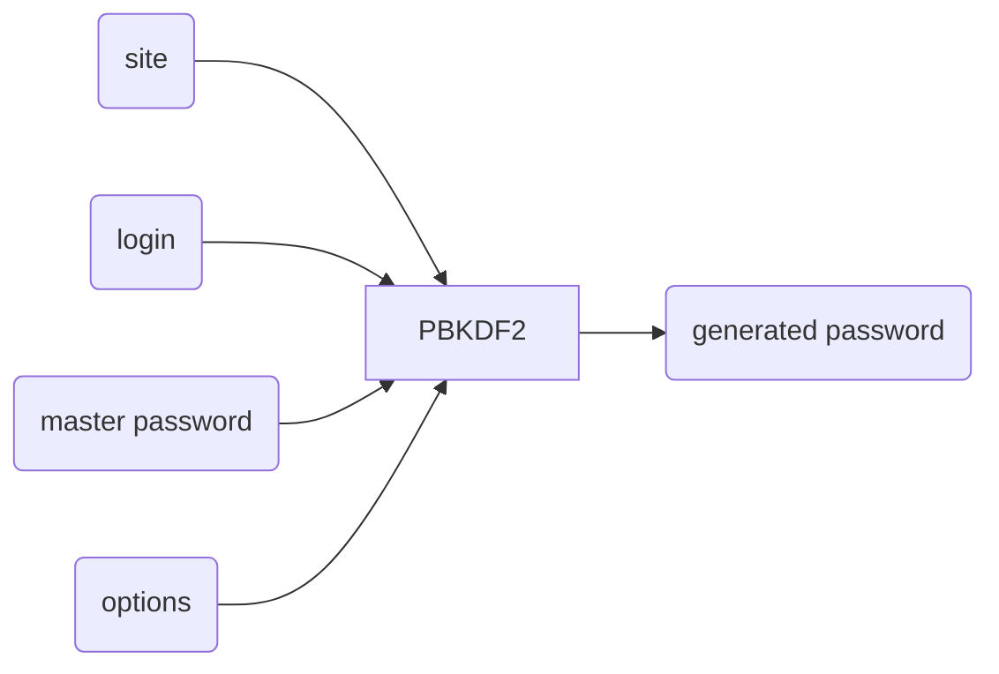
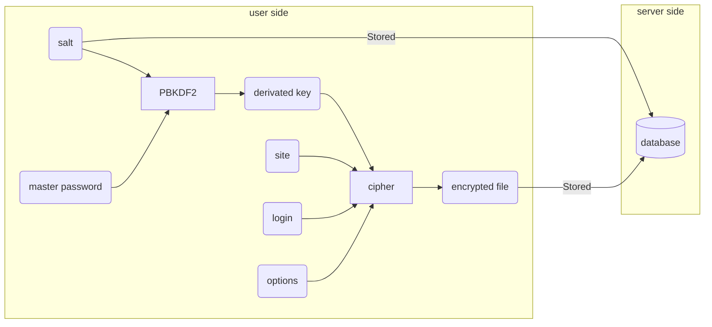
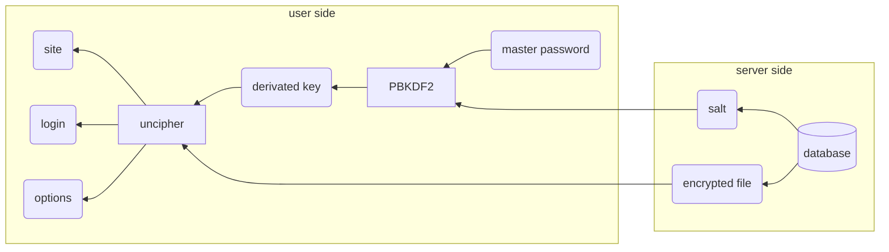

# 	Zero-Knowledge-Password-Manager-Design

Spécifications et design d'un gestionnaire de mots de passe décentralisé sans tiers de confiance

    

Regarder sur GitHub

---

## Sommaire

[toc]

## Utilité du gestionnaire de mots de passe

TODO: manque un mot

> Pourquoi je utiliser un gestionnaire de mots de passe ? J'y arrive très bien comme ça

TODO: ajouter des chiffres de 'ANSSI

À l'ère d'Internet, le nombre de mots de passes utilisés par individu explose. Pourtant, nos cerveaux de primates ne sont pas adaptés pour respecter les bonnes pratiques ( notamment recommandées par l'ANSSI). Que fait-on dans ce cas ? On ré-utilise nos mots de passe, parfois en les modifiant légèrement.

TODO: insérer des statistiques sur le non-respect des bonnes pratiques

Les bonnes pratiques pour un bon mot de passe sont :

TODO: ajouter une reference vers l'ANSSI

*   8 caractères minimum
*   des chiffres, des lettres majuscules et minuscule et des caractères spéciaux
*   pas de lien logique entre les caractères (dates, mots d'une langue, etc...)
*   pas de permutation (les *E* en *3*, *a* en *@*, *o* en *0*, etc...)

Et le point le plus important est le suivant :

*   pas de lien logique entre les mots de passe (réutilisation, modification, permutation, etc...)

> Je respecte plusieurs points de la liste, ça suffit non ?

Absolument pas ! Il est primordial que **chacun** des points ci-dessus soient respectés, sans quoi vos mots de passe ne sont pas sécurisés. 

Si jamais un attaquant souhaite s'en prendre à vous particulièrement, afin de revendre des données sur vous par exemple, il suffit que l'un de ses points ne soient pas respecté pour qu'il puisse avoir accès à vos comptes personnels.

TODO: insérer
**Chiffres sur la durée pour casser un mdp en fonction de la longueur et du jeu de caractères**

Pour remédier à cela, une seule solution : utiliser un gestionnaire de mots de passe !

> Mais je n'ai pas envie de payer une solution ! Je préfère encore rester comme ça

Il est vrai que le marché des gestionnaires de mots de passe est juteux, et de nombreux acteurs du marché sont là pour en profiter.

En dehors du problème de payer une solution, se poser aussi le problème de la confiance : que se passe-t-il si jamais l'entreprise a une fuite de données ? Comme vérifier que mes données sont sécurisées comme il m'a été promis qu'elles le sont ? Ce n'est pas possible.

Un alternative aux solutions payantes qui utilisent un tiers de confiance existe, mais elles sont trop souvent destinées à des connaisseurs, et inaccessibles au grand public.

Dans la suite, nous allons essayer de comprendre pourquoi la situation est ainsi, dans un monde où tout le monde devrait avoir accès à un gestionnaire de mots de passe.

## Fonctionnement

Tout d'abord, nous allons nous intéresser aux différents fonctionnements possibles d'un gestionnaire de mots de passe. 

Cette partie n'est pas nécessaire si vous cherchez juste une alternative facile d'accès et gratuite, mais il est important de comprendre comment les gestionnaires de mots de passe fonctionnent pour ne pas faire confiance aveuglément dans une solution donnée.

Voici comment peuvent fonctionner les gestionnaires de mots de passe :

*   **Solution fichier chiffré sur le disque** : problème de fonctionnalité, pas de sync, acceptation du grand public
*   **Solution fichier chiffré sur un serveur** : solution payante par design, question de confiance
*   **Solution stateless** : manque de cas pratiques, besoin de changer le mot de passe, se souvenir de la configuration
*   **Git based**
*   **Blockchain based**

TODO: faire des illustrations avec des diagrammes

Assez parlé de la théorie ! Dans la prochaine section, nous allons nous intéresser aux critères qui permettent de comparer les gestionnaires de mots de passe, puis voir lesquels sont les plus adaptées selon ces critères.

## Comparaison

### Critères

Pour l'instant, nous cherchons à ratisser large, nous
ne prenons donc pas en compte des critères trop élaborés en lien avec des fonctionnalités.

Voici quels sont nos critères pour cette comparaison :

*   Licence
*   Open source
*   Fonctionnement
*   OS
*   Accès public au fichier chiffré
*   Synchronisation
*   Protection des données

Maintenant ces critères établis, passons à la comparaison à proprement parler.

### Gestionnaires de mots de passe

*   1Password
*   Bitwarden
*   Dashlane
*   KeePassXC
*   NordPass
*   Remembear
*   Enpass
*   Keeper Password Manager
*   pass
*   Password store
*   Google
*   You.
*   Safeguard
*   LastPass
*   KeePass
*   Keeper
*   LockSelf
*   LessPass
*   PassBolt
*   Password Safe

### Conclusion

TODO: faire dabord la comparaison et faire la suite UNIQUEMENT si aucun résultat n'est pertinent ou satisfaisant

## Solution

### Stockage des mots de passe

KeePass / pass

### Gestion de version

Git

### Synchronisation pair-à-pair

WebRTC

### Résolution NAT

WebRTC

### Chiffrement de bout-en-bout

Double Ratchet et Sésame du Signal Protocol

## Fonctionnalités

[...]

*   extension sur navigateur, application + processus démon sur smartphone
*   mémorisation du mot de passe maître pendant 14 jours
*   récupération et déchiffrement automatique à l'ouverture
*   remplissage automatique des informations sur le site

TODO: pomper les fonctionnalités sur la comparaison Wikipédia et sur les autres solutions

----

## Schémas à réutiliser

