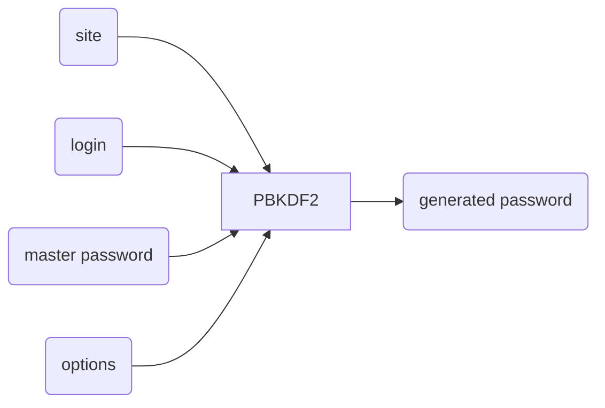
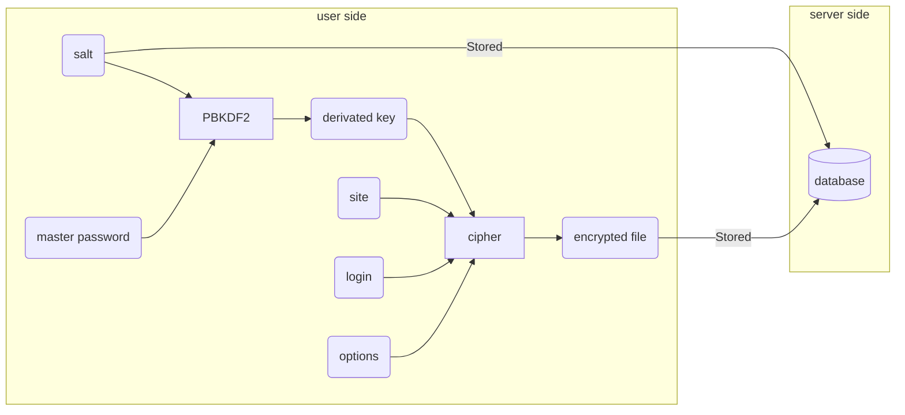
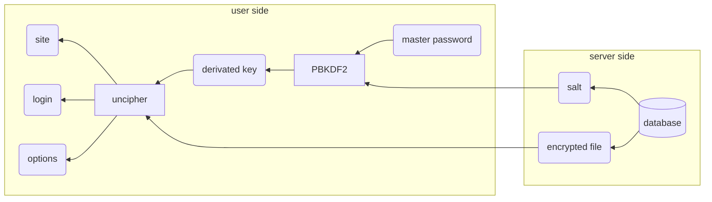

# 	Zero-Knowledge-Password-Manager-Design

Spécifications et design d'un gestionnaire de mots de passe décentralisé sans tiers de confiance

    

Regarder sur GitHub

---

## Sommaire

[toc]

## Utilité du gestionnaire de mots de passe

*Si vous n'êtes pas convaincu par la nécessité d'un gestionnaire de mots de passe [...]*

[...]

Un bon mot de passe :

*   8 caractères minimum
*   des chiffres, des lettres majuscules et minuscule et des caractères spéciaux
*   pas de lien logique entre les caractères (dates, mots d'une langue, etc...)
*   pas de permutation (les *E* en *3*, *a* en *@*, *o* en *0*, etc...)
*   pas de lien logique entre les mots de passe (réutilisation, modification, permutation, etc...)

[...]

**Chiffres sur la durée pour casser un mdp en fonction de la longueur et du jeu de caractères**

## Fonctionnement

[...]

*   **Solution fichier chiffré sur le disque** : problème de fonctionnalité, pas de sync, acceptation du grand public
*   **Solution fichier chiffré sur un serveur** : solution payante par design, question de confiance
*   **Solution stateless** : manque de cas pratiques, besoin de changer le mot de passe, se souvenir de la configuration
*   **Git based**
*   **Blockchain based**

[...]

## Comparaison

### Critères

*   License
*   Open source
*   Fonctionnement
*   OS
*   

### Gestionnaires de mots de passe

*   1Password
*   Bitwarden
*   Dashlane
*   KeePassXC
*   NordPass
*   Remembear
*   Enpass
*   Keeper Password Manager
*   pass
*   Password store
*   Google
*   You.
*   Safeguard
*   LastPass
*   KeePass
*   Keeper
*   LockSelf
*   LessPass
*   PassBolt
*   Password Safe

## Solution

### Stockage des mots de passe

KeePass / pass

### Gestion de version

Git

### Synchronisation pair-à-pair

WebRTC

### Résolution NAT

WebRTC

### Chiffrement de bout-en-bout

Double Ratchet et Sésame du Signal Protocol

## Fonctionnalités

[...]

*   extension sur navigateur, application + processus démon sur smartphone
*   mémorisation du mot de passe maître pendant 14 jours
*   récupération et déchiffrement automatique à l'ouverture
*   remplissage automatique des informations sur le site

----

## Schémas à réutiliser

