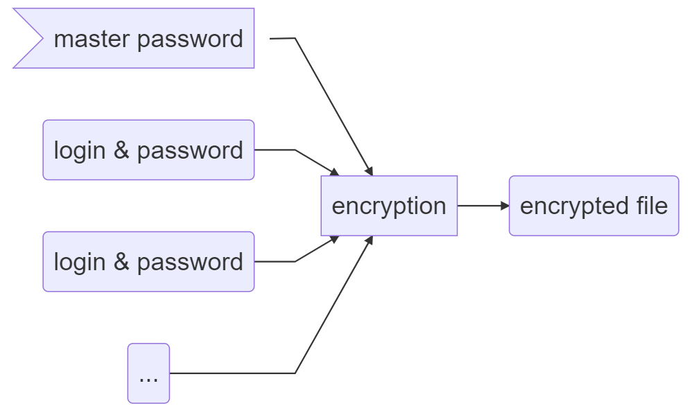
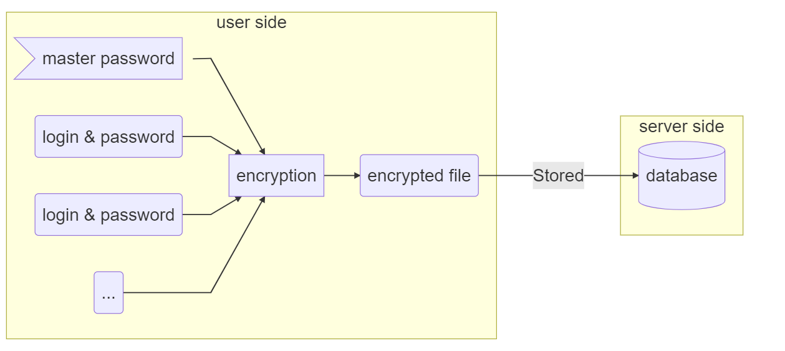
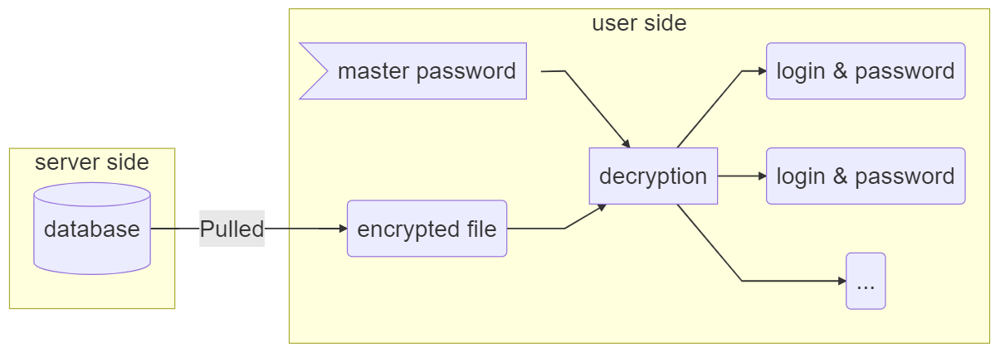
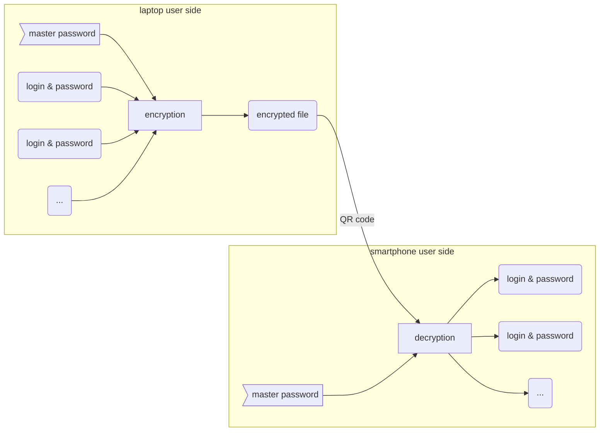

# 		Synchronized-Decentralized-Password-Manager

Spécifications et design d'un gestionnaire de mots de passe décentralisé sans tiers de confiance

    

Regarder sur GitHub

---

## Sommaire

[toc]

## Utilité du gestionnaire de mots de passe

[Aller à la section suivante](#fonctionnement)

>   Pourquoi devrais-je utiliser un gestionnaire de mots de passe ?

À l'ère d'Internet, le nombre de mots de passes utilisés par individu explose. Selon les sources, nous aurions au minimum 70 mots de passe par personne[^1]. Pourtant, nos cerveaux de primates ne sont pas adaptés pour respecter les bonnes pratiques, recommandées notamment par l'ANSSI. Que fait-on dans ce cas ? On réutilise nos mots de passe, parfois en les modifiant légèrement.

D'après une enquête d'Avast en 2019[^2], 93% des Français ne respectent pas les bonnes pratiques en terme de mots de passe.

Ces bonnes pratiques[^3] sont :

*   12 caractères minimum
*   des chiffres, des lettres majuscules et minuscule et des caractères spéciaux
*   pas de lien logique entre les caractères (dates, mots d'une langue, etc...)
*   pas de permutation (les *E* en *3*, *a* en *@*, *o* en *0*, etc...)

Et le point le plus important est le suivant :

*   pas de lien logique entre les mots de passe (réutilisation, modification, permutation, etc...)

> Je respecte plusieurs points de la liste, ça suffit non ?

Absolument pas ! Il est primordial que **chacun** des points ci-dessus soient respectés, sans quoi vos mots de passe ne sont pas protégés.

Si jamais un attaquant souhaite s'en prendre à vous, afin de revendre des données sur vous par exemple, il suffit que l'un de ses points ne soit pas respecté pour qu'il puisse avoir accès à vos comptes personnels.

Les mots de passe de moins de **12 caractères** dans un alphabet de 90 symboles (majuscules, minuscule, chiffres et caractères spéciaux communs comme #, $, * et %) sont considérés comme **faibles** par l'ANSSI[^4].

Pour remédier à cela, une seule solution : **utiliser un gestionnaire de mots de passe** !

> Mais je n'ai pas envie de payer une solution ! Je préfère encore rester comme ça

Il est vrai que le marché des gestionnaires de mots de passe est juteux, et de nombreux acteurs du marché sont là pour en profiter.

En dehors du fait de payer une solution, se pose aussi le problème de la confiance : que se passe-t-il si jamais l'entreprise qui gère nos mots de passe a une fuite de données ? Comme vérifier que mes données sont sécurisées comme il m'a été promis qu'elles le sont ? Ce n'est pas possible.

Il existe des alternatives aux solutions payantes qui utilisent un tiers de confiance, mais elles sont trop souvent destinées à des connaisseurs, et inaccessibles au grand public.

Dans la suite, nous allons essayer de comprendre pourquoi la situation est ainsi, dans un monde où tout le monde devrait avoir accès à un gestionnaire de mots de passe.

[^1]: [article de Newswire](https://www.newswire.com/news/new-research-most-people-have-70-80-passwords-21103705)
[^2]: [article de Avast](https://press.avast.com/fr-fr/enqu%C3%AAte-avast-93-des-fran%C3%A7ais-utilisent-des-mots-de-passe-faibles)
[^3]: [recommandations de l'ANSSI](https://www.ssi.gouv.fr/guide/mot-de-passe/)
[^4]: [calculateur de force d'un mot de passe de l'ANSSI](https://www.ssi.gouv.fr/administration/precautions-elementaires/calculer-la-force-dun-mot-de-passe/)

## Fonctionnement

[Aller à la section suivante](#comparaison)

Un gestionnaire de mots de passe est un logiciel permettant de stocker tous vos mots de passe de **manière sécurisée**. Pour cela, vous aurez besoin de ne retenir qu'un seul mot de passe, votre **mot de passe maître** (*master password*), celui-ci vous permettra d'accéder à vos autres mots de passe lorsque vous en aurez besoin. En plus de cela, de nombreux gestionnaires de mots de passe vous proposent aujourd'hui de générer aléatoirement des mots de passe sur mesure, que vous stockerez dans votre gestionnaire de mots de passe sans avoir besoin de les retenir.

Le gestionnaire de mots de passes est en quelque sorte un coffre-fort dans lequel vous pouvez déposer toutes vos clés sans avoir besoin de les protéger, et vous n'avez plus besoin que de faire attention à la clé de ce coffre-fort.

Tout d'abord, nous allons nous intéresser aux différents fonctionnements possibles d'un gestionnaire de mots de passe.

Cette partie n'est pas nécessaire si vous cherchez uniquement une alternative gratuite et facile d'accès, mais il est important de comprendre comment les gestionnaires de mots de passe fonctionnent pour ne pas faire confiance aveuglément dans une solution donnée.

>   Note : Dans les explications qui suivent, le fonctionnement des gestionnaires de mots de passe est simplifié, on n'abordera notamment pas les notions de salage cryptographique ou de fonction de dérivation de clé.

### Fichier chiffré sur le disque

C'est le fonctionnement de base d'un gestionnaire de mots de passe. Tous vos mots de passe sont assemblés en un fichier chiffré sur votre disque dur grâce au mot de passe maître. De cette manière, une personne qui accéderait à votre ordinateur ne peut récupérer vos mots de passe sans connaître votre mot de passe maître.

Une fois que vous avez besoin d'accéder à vos mots de passe, pour vous connecter quelque part par exemple, il vous suffit de rentrer votre mot de passe maître dans votre gestionnaire de mot de passe pour déchiffrer le fichier qui contient tous vos mots de passe.

*Exemple* : KeePass

**Désavantage** :

*   Vos mots de passe sont stockés sur l'espace disque d'un seul appareil, votre ordinateur ou votre smartphone. **Vous ne pouvez pas** accéder à vos mots de passe depuis un autre appareil. Notamment, **il n'y a pas de synchronisation** entre vos appareils. Cette contrainte implique que ce type de gestionnaires de mots de passe est peu utilisé dans le grand public.  

### Synchronisation via un serveur

Pour parvenir à synchroniser vos mots de passe entre différents appareils, de entreprises vous proposent de stocker pour vous le fichier chiffré qui contient tous vos mots de passe. Ils vous assurent que vos données sont bien protégées, mais ça à priori il n'y a pas de moyen de le vérifier.

Ici le service qui vous est vendu, c'est celui d'avoir à disposition, dans un serveur d'une entreprise privée, vos mots de passe sous la forme d'un fichier chiffré. Ainsi, n'importe où dans le monde et à n'importe quel moment, vous pouvez vous connecter à votre compte et récupérer vos mots de passe. De la même manière, quand vous ajoutez des nouveaux mots de passe, le fichier chiffré est mis à jour, la synchronisation est donc totale.

*Exemples* : 1PassWord, BitWarden, NordPass, Dashlane, etc.

**Désavantages** :

*   Bien sûr en tout premier, on pense au fait que cette solution soit payante, parfois assez chère. Cela constitue un énorme frein pour que le grand public adopte cette solution.
*   En second lieu, la question de la confiance se pose, puisqu'une entreprise va avoir la main mise sur tous vos mots de passe, sous format chiffré tout de même, mais il serait audacieux d'imaginer que ce fichier est incassable.

### Solution stateless

Puisque le problème est de stocker le fichier chiffré quelque part, les solutions stateless proposent une toute nouvelle approche : au lieu de stocker les mots de passe pour que vous puissiez y accéder pour vous connecter sur vos sites, il est question ici de *calculer* vos mots de passe à partir de votre mot de passe maître et d'informations comme le nom du site. Plus besoin de *stocker* vos mots de passe : comme le mot de passe de votre site est *calculé*, il vous suffit de fournir les mêmes informations d'une connexion sur l'autre avoir votre mot de passe.

*Exemple* : LessPass

**Désavantages** :

*   Ces solutions impliquent de changer tous vos mots de passes sur tous les sites pour utiliser le gestionnaires, puisque les mots de passe que vous utiliserez par la suite seront ceux calculés par le gestionnaire. Même si cela est souvent une bonne pratique de changer tous ses mots de passe la première fois que l'on utilise un gestionnaire de mots de passe, c'est une étape contraignante qui peut rebuter à l'utilisation grand public.
*   Selon les services, vous pouvez avoir un seul identifiant et mot de passe pour plusieurs sites. Il faut alors se souvenir du site à utiliser pour le calcul du mot de passe. Il est également possible de configurer la complexité du mot de passe généré, mais vous devez vous souvenir de cette configuration. Pour palier à ce problème, certains services proposent de stocker votre configuration sous forme de fichier... dans leurs serveurs.

### Basé sur un dépôt Git

Pour revenir sur la solution d'un fichier chiffré sans passer par un serveur payant, il faut trouver un moyen de décentraliser la synchronisation entre plusieurs appareils. La première solution pour ça est d'utiliser un gestionnaire de version, comme Git. Si vous ne connaissez pas Git, c'est un outil de gestion de version très répandu, qui permet notamment aux développeurs logiciels de gérer des implémentations complexes selon les fonctionnalités du code, seul ou en équipe.

Dans notre cas, nous allons créer un dépôt dans lequel nos mots de passe seront autant de fichiers chiffrés indépendamment, de telle sorte qu'il soit possible de modifier ou d'ajouter un mot de passe sans avoir à gérer des conflits entre les versions.

L'utilisation de Git permet de gérer facilement les versions pour garantir la synchronisation, mais ne résout pas du tout le problème d'accès au dépôt depuis un autre appareil.

*Exemple* : Pass

**Désavantage** :

*   Le dépôt utilisé par Git doit être accessible publiquement afin de pouvoir accéder aux mots de passe chiffrés. Cette solution suppose que vous avez accès à un tel dépôt, ce qui peut être fait soit en utilisant un dépôt sur un site public, auquel cas on retourne sur la question de la confiance, soit on configure son dépôt Git chez soi pour qu'il soit accessible depuis Internet, ce qui peut poser de gros problèmes de sécurité.

### Basé sur la Blockchain

Pour décentraliser la synchronisation, il est également possible d'utiliser la Blockchain, c'est-à-dire stocker dans l'espace public décentralisé qu'est la Blockchain le fichier chiffré qui contient vos mots de passe. Ce type de solution vous propose de créer un portefeuille, ou *wallet*, ce qui vous fournit une identité dans la Blockchain. Il n'est pas spécialement question d'utiliser ce portefeuille afin d'y stocker de l'argent. Grâce à cette identité, vous aurez le droit d'ajouter des informations dans la Blockchain. Comme la Blockchain est publique, l'idée est de l'utiliser pour stocker le fichier chiffré qui contient vos mots de passe.

Il faut cependant faire attention aux solutions basées sur la Blockchain. C'est une technologie très prometteuse dans le domaine de l'informatique, mais qui est très souvent liée au concept de cryptomonnaies. Il faut donc être bien conscient que lorsque vous utilisez une Blockchain publique, même si vous ne donnez pas vous-même d'argent, vous contribuez à l'utilisation de cette Blockchain et vous participez à des comportements spéculatifs.

*Exemple* : You.

**Désavantages** :

*   La Blockchain offre de la non-répudiation, c'est-à-dire que l'on garde une trace précise de qui ajoute quelle information. Vous n'êtes protégé que par l'anonymat offert par la solution, et vous devez donc leur faire confiance pour préserver cet anonymat.
*   Par nature de la Blockchain, vos mots de passe chiffrés sont disponibles publiquement, et il serait prétentieux de penser que le fichier chiffré est incassable. De manière générale, même si vos données sont protégées par du chiffrement, il ne vaut mieux pas tenter de provoquer des attaques.
*   Les données inscrites dans la Blockchain sont immuables, c'est-à-dire qu'une fois que vous avez écrit quelque chose dans la Blockchain, il est impossible de le modifier, de par le fonctionnement de la Blockchain. Cela ne veut pas dire que vous ne pouvez pas changer vos mots de passe, puisque vous pouvez mettre à jour le fichier chiffré aussi souvent que vous voulez, mais les données chiffrées obsolètes resteront dans la Blockchain à jamais.

## Comparaison

Assez parlé de théorie ! Dans cette section, nous allons nous intéresser aux critères qui permettent de comparer les gestionnaires de mots de passe, puis voir lesquels sont les plus adaptées selon ces critères.

### Critères

Dans un premier temps, nous

Pour l'instant, nous cherchons à ratisser large, nous ne prenons donc pas en compte des critères trop élaborés en lien avec des fonctionnalités.

Voici quels sont nos critères pour cette comparaison :

*   **Licence** : *propriétaire*, *freemium*, *libre*
*   **Open source **: *oui*, *non*
*   **Fonctionnement** : *local*, *serveur*, *stateless*, *git*, *blockchain*
*   **OS** : *navigateur*, *Windows*, *macOS*, *Linux*, *Android*, *iOS*
*   **Accès public au fichier chiffré** : *possible*, *connexion requise*, *impossible*
*   **Synchronisation** :  *oui*, *non*
*   **Vie privée** : *Compte obligatoire*, *compte facultatif*, *compte inexistant*

Maintenant ces critères établis, passons à la comparaison à proprement parler.

### Gestionnaires de mots de passe

|     Gestionnaire      |           Licence            | Open Source |     Fonctionnement     |                              OS                              |          Accès public           | Synchronisation  |        Vie privée        |
| :-------------------: | :--------------------------: | :---------: | :--------------------: | :----------------------------------------------------------: | :-----------------------------: | :--------------: | :----------------------: |
|       1Password       |         propriétaire         |     non     |        serveur         |       navigateur, Android, iOS, Linux, macOS, Windows        |            connexion            |       oui        |       obligatoire        |
|       Bitwarden       |  libre (AGPLv3 / GNU GPLv3)  |     oui     |        serveur         |       navigateur, Android, iOS, Linux, macOS, Windows        |            connexion            |       oui        |       obligatoire        |
|       Dashlane        |   propriétaire / freemium    |     non     |        serveur         |           navigateur, Android, iOS, macOS, Windows           |            connexion            |       oui        |       obligatoire        |
|        Enpass         |         propriétaire         |     non     |        serveur         |       navigateur, Android, iOS, Linux, macOS, Windows        |            connexion            |       oui        |       obligatoire        |
|       Entropass       |         libre (MIT)          |     oui     |       stateless        |                          navigateur                          |           impossible            |       oui        |        inexistant        |
|   Firefox Lockwise    |       libre (MPL 2.0)        |     oui     |        serveur         |                   navigateur, Android, iOS                   |            connexion            |       oui        |       obligatoire        |
|    Google Password    |         propriétaire         |     non     |        serveur         |                     navigateur, Android                      |            connexion            |       oui        |       obligatoire        |
|        KeePass        |        libre (GPLv2)         |     oui     |         local          | navigateur, Android, iOS (extensions), Linux, macOS, Windows |           impossible            | oui (extensions) |        inexistant        |
|        Keeper         |   propriétaire / freemium    |     non     |        serveur         |              navigateur, macOS, Linux, Windows               |            connexion            |       oui        |       obligatoire        |
|       Keychain        |        libre (GPLv2)         |     non     |        serveur         |                          iOS, macOS                          |            connexion            |       oui        |       obligatoire        |
|       LastPass        |   propriétaire / freemium    |     non     |        serveur         |                          navigateur                          |            connexion            |       oui        |       obligatoire        |
|       LessPass        |        libre (GPLv3)         |     oui     |       stateless        |                          navigateur                          |           impossible            |       oui        |        facultatif        |
|       LockPass        |         propriétaire         |     non     |        serveur         |                          navigateur                          |            connexion            |       oui        |       obligatoire        |
|       NordPass        |   propriétaire / freemium    |     non     |        serveur         |                          navigateur                          |            connexion            |       oui        |       obligatoire        |
| Pass (Password store) |        libre (GPLv2+)        |     oui     |          git           |    navigateur, Android, iOS, Windows (extensions), Linux     | connexion (selon configuration) | oui (avec tiers) |        inexistant        |
|       PassBolt        |        libre (AGPL-3)        |     oui     | serveur (réseau local) |                          navigateur                          |            connexion            |       oui        | obligatoire (entreprise) |
|     Password Safe     | libre (Artistic License 2.0) |     oui     |         local          |                    maxOS, Linux, Windows                     |           impossible            |       non        |        inexistant        |
|       Remembear       |         propriétaire         |     non     |        serveur         |       navigateur, Android, iOS, Linux, macOS, Windows        |            connexion            |       oui        |       obligatoire        |
|       Safeguard       |         propriétaire         |     non     |       blockchain       |                          navigateur                          |            possible             |       oui        |       obligatoire        |
|         You.          |         propriétaire         |     non     |       blockchain       |                   navigateur, Android, iOS                   |            possible             |       oui        |       obligatoire        |

### Conclusion

Le résultat de cette comparaison est qu'il n'existe pas gestionnaires de mots de passe qui soit à la fois gratuit et simple d'utilisation, qui synchronise les mots de passe entre les appareils automatiquement et qui ne passe pas par un tiers de confiance.

Le but des paragraphes suivants est de définir et concevoir un gestionnaire de mots de passe qui réponde à ce besoin.

## Solution

### Stockage des mots de passe

KeePass / pass

### Gestion de version

Git

### Synchronisation pair-à-pair

WebRTC

### Résolution NAT

WebRTC

### Chiffrement de bout-en-bout

Double Ratchet et Sésame du Signal Protocol

## Fonctionnalités

[...]

*   extension sur navigateur, application + processus démon sur smartphone
*   mémorisation du mot de passe maître pendant 14 jours
*   récupération et déchiffrement automatique à l'ouverture
*   remplissage automatique des informations sur le site

TODO: pomper les fonctionnalités sur la comparaison Wikipédia et sur les autres solutions

## Exemple diagramme

