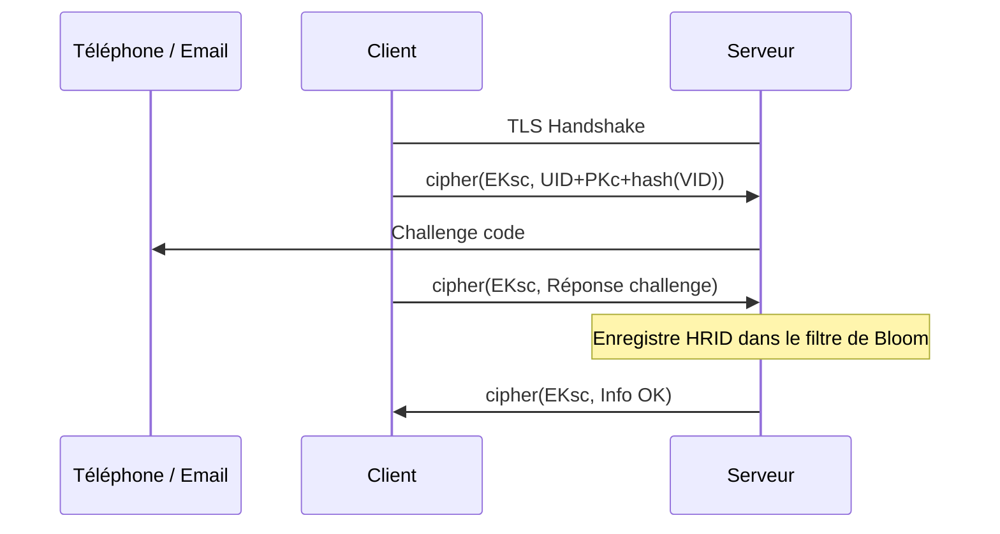
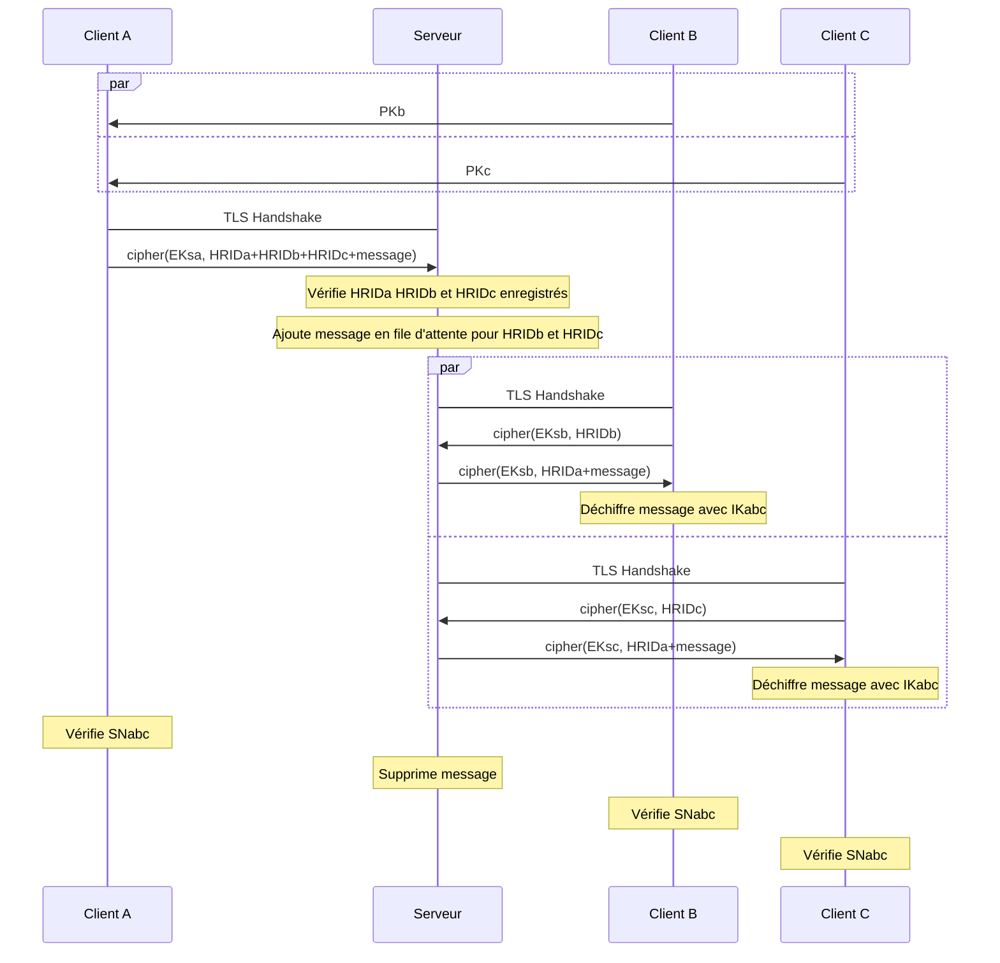
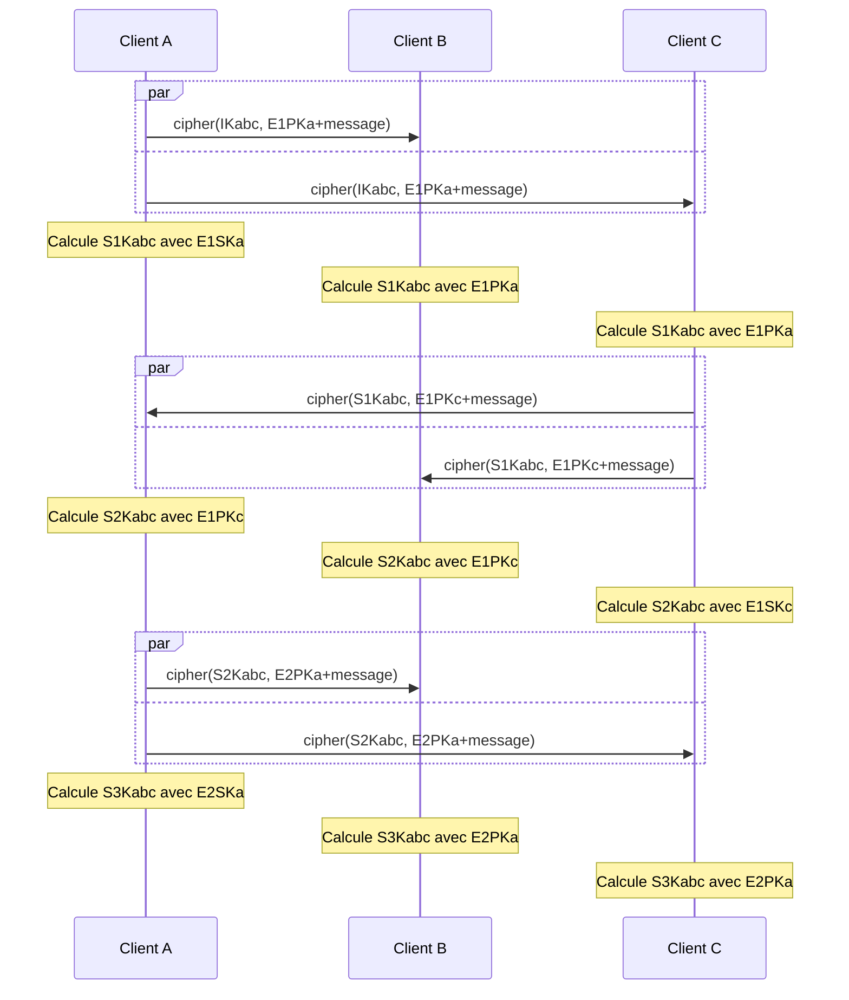

```mermaid
sequenceDiagram
	participant TE as Téléphone / Email
    participant C as Client
    participant S as Serveur
    C -> S: TLS Handshake
    C ->> S: cipher(EKsc, UID+PKc+hash(VID))
    S ->> TE: Challenge code
    C ->> S: cipher(EKsc, Réponse challenge)
    Note over S: Enregistre HRID dans le filtre de Bloom
    S ->> C: cipher(EKsc, Info OK)
```

```mermaid
sequenceDiagram
    participant A as Client A
    participant S as Serveur
    participant B as Client B
    participant C as Client C
    par
    B ->> A: PKb
    and
    C ->> A: PKc
    end
    A -> S: TLS Handshake
    A ->> S: cipher(EKsa, HRIDa+HRIDb+HRIDc+message)
    Note over S: Vérifie HRIDa HRIDb et HRIDc enregistrés
    Note over S: Ajoute message en file d'attente pour HRIDb et HRIDc
    par
    B -> S: TLS Handshake
    B ->> S: cipher(EKsb, HRIDb)
    S ->> B: cipher(EKsb, HRIDa+message)
    Note over B: Déchiffre message avec IKabc
    and
    C -> S: TLS Handshake
    C ->> S: cipher(EKsc, HRIDc)
    S ->> C: cipher(EKsc, HRIDa+message)
    Note over C: Déchiffre message avec IKabc
    end
    Note over A: Vérifie SNabc
    Note over S: Supprime message
    Note over B: Vérifie SNabc
    Note over C: Vérifie SNabc
```

```mermaid
sequenceDiagram
    participant A as Client A
    participant B as Client B
    participant C as Client C
    par
    A ->> B: cipher(IKabc, E1PKa+message)
    and
    A ->> C: cipher(IKabc, E1PKa+message)
    end
    Note over A: Calcule S1Kabc avec E1SKa
    Note over B: Calcule S1Kabc avec E1PKa
    Note over C: Calcule S1Kabc avec E1PKa

    par
    C ->> A: cipher(S1Kabc, E1PKc+message)
    and
    C ->> B: cipher(S1Kabc, E1PKc+message)
    end
    Note over A: Calcule S2Kabc avec E1PKc
    Note over B: Calcule S2Kabc avec E1PKc
    Note over C: Calcule S2Kabc avec E1SKc

    par
    A ->> B: cipher(S2Kabc, E2PKa+message)
    and
    A ->> C: cipher(S2Kabc, E2PKa+message)
    end
    Note over A: Calcule S3Kabc avec E2SKa
    Note over B: Calcule S3Kabc avec E2PKa
    Note over C: Calcule S3Kabc avec E2PKa
```
