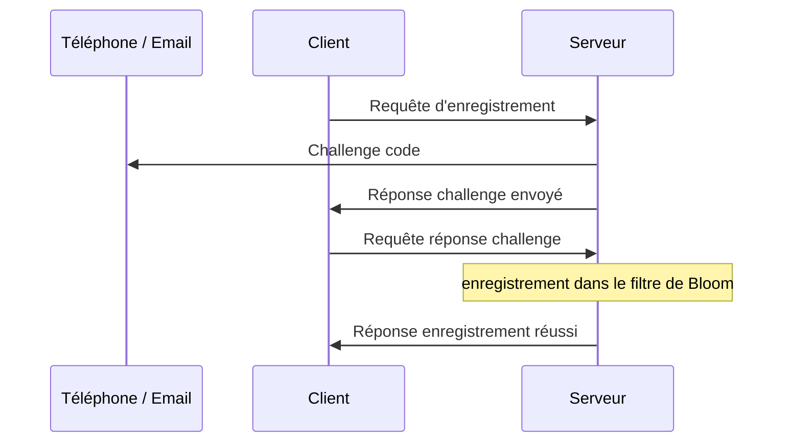
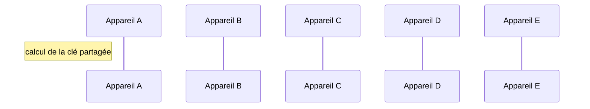

# Spécifications techniques

Spécifications de la solution retenue et des implications pratiques

[Page précédente : Solutions](https://relex12.github.io/fr/Decentralized-Password-Manager/Solutions)

[Page suivante : Fonctionnalités](https://relex12.github.io/fr/Decentralized-Password-Manager/Fonctionnalites)

## Sommaire

[toc]

## Terminologie

**Appareil** : Périphérique avec lequel interragit l'utilisateur pour accéder, entre autres, au gestionnaire de mots de passe

**Client** : Application assurant la communication avec le serveur depuis un appareil de l'utilisateur, désigne autant les applications mobiles, web ou en ligne de commande, officielles ou d'implémentation autre

**Serveur** : Périphérique de communication centralisé assurant le stockage jusqu'à la distribution des messages sur tous les appareils, désigne autant l'implémentation officielle ou autre, le serveur est considéré unique, les problématiques de résolution d'adresse ou de balance de charge ne sont pas prises en compte

**Coffre** : Ensemble de mots de passe stockés à l'intérieur d'un client et partagé avec d'autres appareils, chaque client peut posséder plusieurs coffres qui ne sont pas nécessairement partagés avec les mêmes appareils

## Initialisation du coffre

Avant de pouvoir contenir les secrets d'un utilisateur, un coffre doit être initialisé. Cette initialisation comprend deux parties : l'enregistrement de chaque client auprès d'un serveur pour assurer la livraison des futurs messages et le partage des informations entre les clients pour se découvrir mutuellement.

### Enregistrement sur le serveur

Tout utilisateur qui souhaite communiquer avec le serveur doit au préalable s'être enregistré auprès de celui-ci. Le but est de limiter la surface d'attaque sur le serveur : toute communication qui ne sera pas émise par un utilisateur enregistré sera refusée par le serveur.

Sur chacun de ses appareils, l'utilisateur doit enregistrer le client auprès du serveur. L'enregistrement vaut pour un coffre à l'intérieur d'un client depuis un appareil. Si l'utilisateur ajoute un autre coffre sur un de ses clients, il doit de nouveau procéder à l'enregistrement depuis son appareil. L'utilisateur peut enregistrer en une seule fois plusieurs coffres auprès du serveur, les demandes d'enregistrement sont alors envoyées en parallèle au serveur, mais un seul challenge lui sera demandé pour valider l'ajout de tous les coffres.

Du point de vue du serveur, chaque demande d'enregistrement est composée d'un identifiant utilisateur, de la clé publique du client et d'un identifiant de coffre mis bout à bout, ce qui forme la clé d'enregistrement `user_id:client_public_key:vault_id`. La clé d'enregistrement sera utilisée aussi bien pour vérifier que les messages entrants proviennent d'un appareil enregistré que pour vérifier que les appareils destinataires de ce message sont également tous enregistrés.

L'identifiant de l'utilisateur `user_id` doit permettre de contacter l'utilisateur via un service tiers afin de s'assurer de son identité, il s'agit d'une adresse email ou d'un numéro de téléphone portable. L'adresse email offre l'avantage de la gratuité d'envoi des mail pour le serveur, vis-àvis du numéro de téléphone qui vérifie mieux l'identité de l'utilisateur (il est moins facile d'avoir un nouveau numéro de téléphone qu'une nouvelle adresse email) mais qui nécessite de passer par un tier payant pour envoyer des SMS. Pendant le développement, l'identifiant utilisateur sera une adresse email, à termes cela pourrait évoluer vers un numéro de téléphone. 

La clé publique du client `client_public_key` est créée lors de l'installation de client ou lors de la création du coffre. La clé publique servira d'identifiant pour les appareils avec lesquels le coffre est partagé et sera utilisée pour le calcul de la clé partagée entre les clients. La clé publique d'un client peut être différente pour différents coffres.

L'identifiant du coffre `vault_id` est un code aléatoire de quelques chiffres généré lors de la création du coffre à l'intérieur d'un client. Lorsque l'utilisateur souhaite ajouter un coffre sur autre autre appareil, il doit recopier son identifiant depuis un client qui possède déjà ce coffre. Le premier intérêt de cet identifiant est de fournir une sécurité supplémentaire empêchant un utilisateur malveillant qui tenterait de surcharger le serveur de messages de se faire passer pour un utilisateur déjà enregistré en connaissant son identifiant et sa clé publique s'il ne connaît pas également l'identifiant du coffre. Cet identifiant permet également aux utilisateurs de posséder plusieurs coffres dans un client qui seraient chacun partagés avec des appareils différents. 

> Selon la fréquence et les moyens déployés par les attaquants pour tenter de remplir la pile de messages à envoyer avec des messages frauduleux, il est possible de changer la taille de l'identifiant du coffre de quelques chiffres à 128, 256 ou 512 bits. La recopie de l'identifiant du coffre entre les appareils ne sera alors plus faite manuellement par l'utilisateur, mais via une autre solution de communication comme le Bluetooth, le QR Code ou le protocole ICE directement intégrés à l'application.

#### Séquence d'enregistrement 

L'utilisateur envoie une requête d'enregistrement au serveur depuis un client avec la clé d'enregistrement `user_id:client_public_key:vault_id`. Le serveur envoie un challenge, c'est-à-dire un code à usage unique, via email ou SMS grâce à l'identifiant utilisateur, puis répond au client que le challenge a été envoyé. L'utilisateur doit saisir le code dans le client qui va l'envoyer au serveur. Le serveur ajoute ensuite l'utilisateur au filtre de Bloom et répond une confirmation d'enregistrement au client. La communication peut se terminer.



À l'issu de l'enregistrement, le coffre n'est pas encore partagé entre les appareils. Plus spécifiquement, les clients qui doivent se partager le coffre ne se connaissent pas encore.

#### Fonctionnement du filtre de Bloom

Le filtre de Bloom est une structure de données atypique par son aspect probabiliste. Le filtre de Bloom ne supporte que deux opéarions : l'écriture d'une nouvelle entrée dans la structure et le test de présence d'une entrée. Il n'est pas possible de stocker des données dans cette structure, c'est pourquoi on parle de filtre.

Soit $T$ un tableau de bits de taille $m$ dont toutes les cases sont initiées à 0 et $h$ une famille de $k$ fonctions de hachage cryptographique notées $h_k$ de taille $m$ bits. Donc pour tout $i$ entre 0 et $m$ et pour tout entrée $e$, la sortie de $h_i$ sur $e$ est compris entre 1 et $m$, ce qui correspond à une case du tableau $T$. On suppose que les fonctions de hachage $h_i$ ont été choisies afin de garantir une répartition statistiquement uniforme entre 1 et $m$. 

Pour ajouter un élément dans la structure, il faut calculer successivement les $h_i$ sur cet élément pour $i$ allant de 1 à $m$ et affecter les cases correspondantes à la valeur 1.

```
Fonction ajout(e)
	Pour i de 1 à m
		T[hi(e)] = 1
	Fin Pour
Fin Fonction
```

Pour tester la présence d'un élément, il faut calculer les $h_i$ sur cet élément et vérifier que toutes les cases correspondantes ont la valeur 1. Si au moins une case est à la valeur 0, alors l'élément n'est pas présent.

```
Fonction test(e)
	Pour i de 1 à m
		Si T[hi(e)] = 0 alors
			Retourner Faux
	Fin Pour
	Retourner Vrai
Fin Fonction
```

Après avoir ajouté de nombreux éléments dans la structure, il est probable que lors de l'ajout d'un nouvel élément  $e$ au moins l'une des fonctions $h_i$ évaluée sur $e$ renvoie vers une case du tableau $T$ qui ait déjà la valeur 1, c'est une collision. Cela signifie que lors d'un ajout précédent d'un élément $e'$, il y avait une fonction $h_j$ qui renvoyait la même case, $h_i(e)=h_j(e')$. Ce n'est pas un problème même si plusieurs collisions se produisent lors de l'ajout d'un élément, puisque lors d'un test de présence il faut vérifier que tous les $h_i$ sont non nuls.

À cause de ces collisions, il n'est pas possible de retirer un élément du filtre de Bloom. Si on affectait les cases correspondantes aux $h_i(e)$ à 0, il ne serait pas impossible qu'au moins l'une de celles-ci présente une collision avec un autre élément $e'$. Un test de présence sur cet élément $e'$ après la tentative de suppression de $e$ renverrait alors Faux alors que l'élément avait bien été ajouté.

Il existe une probabilité non nulle que lors du test de présence d'un élément $e$, chacune des $k$ fonctions aient une collision, le test renverra alors que l'élément $e$ est présent alors qu'il n'a pas été ajouté : il s'agit d'un faux positif. La probabilité d'une telle erreur est d'environ $(1-e^{\frac{-kn}m})^k$, où $k$ est le nombre de fonctions de hachage, $m$ est la taille du tableau et $n$ est le nombre d'élément déjà ajoutés dans la structure. Cette approximation est d'autant plus fiable que le rapport $\frac m n$ est faible.

La valeur de $k$ qui minimise le taux de faux positifs est $k=\frac m n \ln2$. En supposant que $k$ est cette valeur optimale et étant donné la probabilité de faux positifs $\epsilon$ et le nombre d'entrée dans la table $n$, la taille optimale est $m=-\frac{n \ln\epsilon}{(\ln2)^2}$.

Dans notre cas d'usage, il faudrait conserver une probabilité de faux positifs $\epsilon$ inférieure à 0.1%, afin de dissuader les attaques par force brute. Le nombre d'entrées dans la structure $n$ peut raisonnablement valoir 1000 pendant le développement, 1 millions en cas de succès du gestionnaire de mots de passe et 1 milliards en cas d'utilisation massive par de très nombreux utilisateurs.

| valeurs pour $\epsilon=10^{-4}$                      | $n=10^3$ |  $n=10^6$  |    $n=10^9$    |
| ---------------------------------------------------- | :------: | :--------: | :------------: |
| $m$ taille en bits du tableau                        |  19200   | 19 200 000 | 19 200 000 000 |
| $k$ nombre de fonctions de hachage                   |   13.3   |    13.3    |      13.3      |
| $\log_2(m)$ longueur en bit des fonctions de hachage |   14.2   |    24.2    |      34.2      |
| taille du filtre de Bloom                            | 2.34 Ko  |  2.29 Mo   |    2.23 Go     |

On observe une taille maximale de l'ordre de quelques Giga octets, ce qui est plus que raisonnable pour autant d'utilisateurs.

#### Redimensionnement du filtre de Bloom

Lorsque le nombre d'entrée dans le filtre de Bloom augmente au delà de ce qui est prévu, la probabilité d'un faux positif dépasse le seuil d'acceptabilité fixé. Il faut alors augmenter la taille du tableau utilisé par le filtre pouvoir stocker d'avantage d'utilisateurs sans augmenter la probabilité de faux positifs. Comme il est possible d'avoir un nombre conséquent d'entrées dans la table pour un espace relativement limité, il est raisonnable de penser que cette opération sera assez rare dans la vie du gestionnaire de mots de passe.

Lorsque cela se produit, le serveur doit conserver deux versions du filtre de Bloom pendant une durée assez longue de transition. Pendant toute cette durée de transition, lorsque le serveur reçoit un message de la part d'un client, il doit procéder aux étapes suivantes :

1. si le client est enregistré dans le nouveau filtre de Bloom alors rien (le client a déjà été enregistré dans la nouvelle table, le message est accepté et placé en attente de livraison) ;
1. sinon si le client est enregistré dans l'ancien filtre de Bloom alors le serveur l'enregistre également dans le nouveau (le message est accepté et placé en attente) ;
1. sinon le client est challengé avant d'être ajouté au nouveau filtre de Bloom (c'est un nouveau client, voir séquence d'enregistrement).

La durée de transition n'a pas de valeur précise définie à l'avance. Elle doit être ajustée afin de permettre que le plus grand nombre d'utilisateurs puissent s'enregistrer sur les deux serveurs. Pour cela, il sera nécessaire de conserver en mémoire le nombre de clients présents dans chaque table, ainsi que pour la durée de transition, le nombre de clients importés depuis l'ancienne table vers la nouvelle via le point numéro 2 ci-dessus. Lorsqu'une proportion suffisante de clients ont été transférés vers la nouvelle table, la durée de transition peut prendre fin.

Les utilisateurs qui tenteront de communiquer avec le serveur après une période d'absence plus grande que la durée de transition seront inconnus du nouveau serveur. Il leur sera alors demandé de s'enregistrer à nouveau auprès du serveur, en procédant à un challenge, comme le décrit la séquence d'enregistrement. Si le client s'enregistre auprès du serveur avec la même clé publique que précédemment, il pourra conserver ses communications avec les autres appareils de manière transparente.

> Si le protocole de chiffrement avec le serveur utilise un Double Ratchet, le client doit à ce moment réinitialiser ses compteurs afin de pouvoir communiquer avec le serveur.

### Partage du coffre entre clients

Comme le serveur n'enregistre aucune donnée sur les clients, il n'est pas possible pour un client de "découvrir" les autres appareils avec lesquels partager un coffre via le serveur. La découverte est prise dans un sens de connaissance des clés publiques des autres clients, il n'y a pas de notion d'adresse puisque leurs moyens communication sont via le serveur ou manuellement via Bluetooth, QR Code ou ICE. Comme ce sont les clients qui décrivent au serveur les appareils auxquels délivrer chaque message, la communication à travers le serveur ne peut pas être utilisée pour cette découverte.

L'utilisateur doit donc connecter ses appareils entre eux en plus de les enregistrer auprès du serveur. Chaque appareil doit être relié à chaque autre manuellement, il y a pour cela deux procédures :

* chaque appareil est relié à tous ceux qu'il ne connait pas encore : le premier appareil est relié à tous les autres, le deuxième à tous sauf le premier, *etc*... ;
*  un appareil maître est relié à chaque appareil une première fois pour récolter leurs clés publiques, puis une seconde fois pour distribuer les clés.

À noter que pour relier deux appareils, l'utilisateur doit manipuler les deux en même temps, c'est donc une opération peu ergonomique. Pour minimiser le nombre de liaisons à avoir, la première méthode est plus efficace pour deux à trois appareils, à partir de cinq c'est la seconde qui nécessite le moins d'opérations. Les clients mettront alors en avant la méthode la plus adapté pour l'utilisateur, mais les deux seront possibles. Il est à prévoir que la plupart des coffres seront créés sur un ou deux appareils avant d'être partagés avec plusieurs autres ultérieurement.

Afin d'assurer à l'utilisateur que tous ses clients ont connaissance les un des autres, le calcul d'un numéro de sécurité prendra en compte le nombre et l'identité des clients qui partagent un coffre. L'utilisateur peut facilement vérifier que tous les clients sont reliés en vérifiant que ce numéro de sécurité est identique sur chacun d'entre eux.

## Communications

Les échanges entre les clients sont des messages contenants les modifications à apporter au coffre stocké sur les appareils. Ces messages sont chiffrés à deux fois par deux clés différentes pour assurer que le déchiffrement ne soit possible qu'en connaissant du mot de passe maître et en utilisant un appareil ayant le droit d'accéder au coffre. Ces messages chiffrés de bout en en bout sont transmis du client au serveur puis du serveur aux autres clients, chacune de ces communications est chiffrée entre le client et le serveur, de sorte qu'un client ne puisse déchiffrer que le message qui lui est destiné.

### Communication entre clients

Pour offrir plus de sécurité, les messages ne doivent pouvoir être déchiffrés qu'en connaissance du mot de passe maître et en utilisant un client ayant accès au coffre. Le fonctionnement du chiffrement basé un mot de passe maître est bien connu : lorsque l'utilisateur entre son mot de passe maître celui-ci est haché grâce à une fonction de hachage cryptographie puis comparé au hash stocké dans le client. Si les valeurs correspondent alors le mot de passe maître est correct, il est ensuite dérivé en clé de chiffrement symétrique grâce à une fonction de dérivation de clé (*key derivation function*, *KDF*), cette clé peut enfin être utilisée pour chiffrer et déchiffrer le coffre.

#### Création d'une clé partagée

La clé qui permet de s'assurer que le chiffrement et déchiffrement a lieu depuis un client ayant le droit d'accès au coffre nécessite de mettre en place un secret partagé entre tous ces clients. Si tous les clients ayant accès à un coffre donné possèdent un secret relatif au coffre, seul un client ayant le droit d'accéder au coffre pourra le déchiffrer, indépendamment de la connaissance de l'utilisateur du mot de passe maître.

La création d'un tel secret est trivial dans le cas où il n'y a que deux appareils : l'échange de clés Diffie-Hellman, compatible avec la cryptographie sur les courbes elliptiques, permet à deux partis de se mettre d'accord sur une valeur commune en un seul tour. Cela signifie que deux côtés peuvent échanger des informations publiquement et parvenir à un secret partagé qu'ils sont les seuls à connaître. Ce secret peut à son tour être dérivé en une clé symétrique que l'on nomme clé partagée ou clé de session. Cette procédure est largement utilisée sur Internet via HTTPS, car le calcul de la clé partagée et son utilisation symétrique sont des calculs bien plus faciles à effecter qu'un chiffrement asymétrique.

Cependant, l'utilisation de l'échange de clés Diffie-Hellman n'est possible que s'il n'y a que deux partis. Il n'existe pas de solution élégante largement reconnue dans le cas d'usage où d'avantages de clients souhaiteraient se mettre d'accord sur une valeur secrète. Le parti pris du protocole Signal est de réaliser un chiffrement pair-à-pair : lorsqu'un message est envoyé dans un groupe, il est en réalité chiffré de manière indépédante pour chaque destinataire puis chaque message ainsi chiffré est transmis au serveur, qui délivrera alors chaque version chiffrée au destinataire correspondant. C'est pour cette raison que lorsqu'un nouvel arrivant entre dans une conversation chiffrée de bout en bout, il n'a pas accès aux messages précédents.

Ce fonctionnement implique qu'un message envoyé au serveur en attente de livraison doit être stocké autant de fois que le message possède de destinataire. S'il était possible de créer un secret partagé entre tous les clients, il n'y aura qu'un seul message à stocker du côté du serveur, dans l'attente de la livraison à chacun des clients. Or la charge de travail du serveur est un sujet primordial afin de mutualiser les coûts de fonctionnement de gestionnaire de mots de passe.

Pour une utilisation sur trois appareils, il est possible d'utiliser la cryptographie à base de couplages


> TODO: parler de 3PBDH, renommer et modifier 3ECDH repo, faire un lien vers les travaux

> TODO: trouver quoi faire des diagragmmes à N appareils dans 3PBDH.md (dans ce repo)
> ajouter ici ou dans 3PBDH > README

> Nombre d'utilisateurs maximal et calcul de clé


#### Ajout d'un nouveau client

> Ajout d'un nouvel utilisateur



TODO: est-ce qu'il y a vraiment besoin d'un diagramme ?


#### Double Ratchet ?

TODO: re regarder computerphile sur Signal : double ratchet, sésame
relire le rapport de PX 2022

Les clés de chiffrements peuvent être différentes : la clé partagée entre les clients et la clé dérivée du mot de passe maître
Ainsi, l'utilisateur ne peut pas déchiffrer ses propres messages même en connaissant le mot de passe maitre, il faut à la fois de connaître de mot de passe maitre et être sur un appareil enregistré connaissant la clé partagée

### Communication avec le serveur

L'envoi de message entre les clients se fait en passant par le serveur

Gestion de la pile de messages à délivrer

Sécurités pour attaques en bourrage de pile

Double Ratchet ?

> Attention : lorsqu'un client envoi un message au serveur, s'il est déjà enregistré, il doit chiffrer / signer ses messages avec la clé publique du serveur pour que celui-ci vérifie que la clé publique utilisée pour ce message est identique à celle annoncée lors de l'enregistrement dans le filtre de Bloom
> En pratique, on metttra en place un Double Ratchet à partir de la clé publique annoncée lors de l'enregistrement dans la table et la clé publique du serveur
> Attention : le serveur doit alors conserver l'état des compteurs du Double Ratchet pour chaque appareil enregistré, noté avec sa clé d'enregistrement `user_id:client_public_key:vault_id`


#### Date de péremption TODO reformuler

