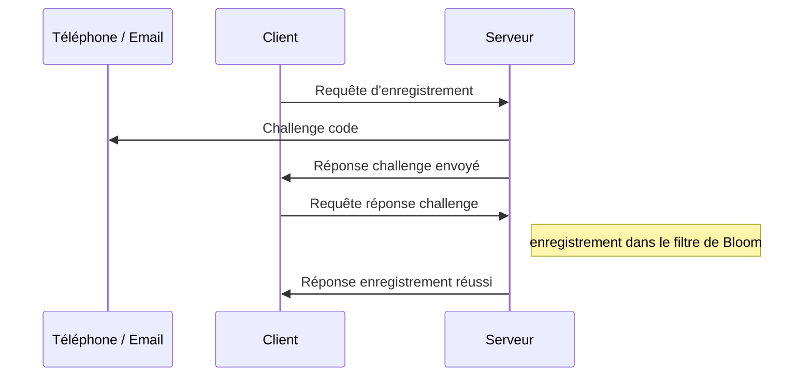

# Spécifications

Spécifications de la solution retenue et des implications pratiques

[Aller à la page précédente](https://relex12.github.io/fr/Decentralized-Password-Manager/Solutions)

[Aller à la page suivante](https://relex12.github.io/fr/Decentralized-Password-Manager/Fonctionnalites)

## Sommaire

[toc]

## Terminologie

**Appareil** : Périphérique avec lequel interragit l'utilisateur pour accéder, entre autres, au gestionnaire de mots de passe

**Client** : Application assurant la communication avec le serveur depuis un appareil de l'utilisateur, désigne autant les applications mobiles, web ou en ligne de commande, officielles ou d'implémentation autre

**Serveur** : Périphérique de communication centralisé assurant le stockage jusqu'à la distribution des messages sur tous les appareils, désigne autant l'implémentation officielle ou autre, le serveur est considéré unique, les problématiques de résolution d'adresse ou de balance de charge ne sont pas prises en compte

**Coffre** : Ensemble de mots de passe stockés à l'intérieur d'un client et partagé avec d'autres appareils, chaque client peut posséder plusieurs coffres qui ne sont pas nécessairement partagés avec les mêmes appareils

## Initialisation du coffre et des clients

### Enregistrement sur le serveur

Tout utilisateur qui souhaite communiquer avec le serveur doit au préalable s'être enregistré auprès de celui-ci. Le but est de limiter la surface d'attaque sur le serveur : toute communication qui ne sera pas émise par un utilisateur enregistré sera refusée par le serveur.

Sur chacun de ses appareils, l'utilisateur doit enregistrer le client auprès du serveur. L'enregistrement vaut pour un coffre à l'intérieur d'un client depuis un appareil. Si l'utilisateur ajoute un autre coffre sur un de ses clients, il doit de nouveau procéder à l'enregistrement depuis son appareil. L'utilisateur peut enregistrer en une seule fois plusieurs coffres auprès du serveur, les demandes d'enregistrement sont alors envoyées en parallèle au serveur, mais un seul challenge lui sera demandé pour valider l'ajout de tous les coffres.

Du point de vue du serveur, chaque demande d'enregistrement est composée d'un identifiant utilisateur, de la clé publique du client et d'un identifiant de coffre mis bout à bout, ce qui forme la clé d'enregistrement `user_id:client_public_key:vault_id`. La clé d'enregistrement sera utilisée aussi bien pour vérifier que les messages entrants proviennent d'un appareil enregistré que pour vérifier que les appareils destinataires de ce message sont également tous enregistrés.

L'identifiant de l'utilisateur `user_id` doit permettre de contacter l'utilisateur via un service tiers afin de s'assurer de son identité, il s'agit d'une adresse email ou d'un numéro de téléphone portable. L'adresse email offre l'avantage de la gratuité d'envoi des mail pour le serveur, vis-àvis du numéro de téléphone qui vérifie mieux l'identité de l'utilisateur (il est moins facile d'avoir un nouveau numéro de téléphone qu'une nouvelle adresse email) mais qui nécessite de passer par un tier payant pour envoyer des SMS. Pendant le développement, l'identifiant utilisateur sera une adresse email, à termes cela pourrait évoluer vers un numéro de téléphone. 

La clé publique du client `client_public_key` est créée lors de l'installation de client ou lors de la création du coffre. La clé publique servira d'identifiant pour les appareils avec lesquels le coffre est partagé et sera utilisée pour le calcul de la clé partagée entre les clients. La clé publique d'un client peut être différente pour différents coffres.

L'identifiant du coffre `vault_id` est un code aléatoire de quelques chiffres généré lors de la création du coffre à l'intérieur d'un client. Lorsque l'utilisateur souhaite ajouter un coffre sur autre autre appareil, il doit recopier son identifiant depuis un client qui possède déjà ce coffre. Le premier intérêt de cet identifiant est de fournir une sécurité supplémentaire empêchant un utilisateur malveillant qui tenterait de surcharger le serveur de messages de se faire passer pour un utilisateur déjà enregistré en connaissant son identifiant et sa clé publique s'il ne connaît pas également l'identifiant du coffre. Cet identifiant permet également aux utilisateurs de posséder plusieurs coffres dans un client qui seraient chacun partagés avec des appareils différents. 

> Selon la fréquence et les moyens déployés par les attaquants pour tenter de remplir la pile de messages à envoyer avec des messages frauduleux, il est possible de changer la taille de l'identifiant du coffre de quelques chiffres à 128, 256 ou 512 bits. La recopie de l'identifiant du coffre entre les appareils ne sera alors plus faite manuellement par l'utilisateur, mais via une autre solution de communication comme le Bluetooth, le QR Code ou le protocole ICE directement intégrés à l'application.

#### Séquence d'enregistrement 

L'utilisateur envoie une requête d'enregistrement au serveur depuis un client avec la clé d'enregistrement `user_id:client_public_key:vault_id`. Le serveur envoie un challenge, c'est-à-dire un code à usage unique, via email ou SMS grâce à l'identifiant utilisateur, puis répond au client que le challenge a été envoyé. L'utilisateur doit saisir le code dans le client qui va l'envoyer au serveur. Le serveur ajoute ensuite l'utilisateur au filtre de Bloom et répond une confirmation d'enregistrement au client. La communication peut se terminer.



À l'issu de l'enregistrement, le coffre n'est pas encore partagé entre les appareils. Plus spécifiquement, les clients qui doivent se partager le coffre ne se connaissent pas encore.

#### Fonctionnement du filtre de Bloom

Le filtre de Bloom est une structure de données atypique par son aspect probabiliste. Le filtre de Bloom ne supporte que deux opéarions : l'écriture d'une nouvelle entrée dans la structure et le test de présence d'une entrée. Il n'est pas possible de stocker des données dans cette structure, c'est pourquoi on parle de filtre.

Soit $T$ un tableau de bits de taille $m$ dont toutes les cases sont initiées à 0 et $h$ une famille de $k$ fonctions de hachage cryptographique notées $h_k$ de taille $m$ bits. Donc pour tout $i$ entre 0 et $m$ et pour tout entrée $e$, la sortie de $h_i$ sur $e$ est compris entre 1 et $m$, ce qui correspond à une case du tableau $T$. On suppose que les fonctions de hachage $h_i$ ont été choisies afin de garantir une répartition statistiquement uniforme entre 1 et $m$. 

Pour ajouter un élément dans la structure, il faut calculer successivement les $h_i$ sur cet élément pour $i$ allant de 1 à $m$ et affecter les cases correspondantes à la valeur 1.

```
Fonction ajout(e)
	Pour i de 1 à m
		T[hi(e)] = 1
	Fin Pour
Fin Fonction
```

Pour tester la présence d'un élément, il faut calculer les $h_i$ sur cet élément et vérifier que toutes les cases correspondantes ont la valeur 1. Si au moins une case est à la valeur 0, alors l'élément n'est pas présent.

```
Fonction test(e)
	Pour i de 1 à m
		Si T[hi(e)] = 0 alors
			Retourner Faux
	Fin Pour
	Retourner Vrai
Fin Fonction
```

Après avoir ajouté de nombreux éléments dans la structure, il est probable que lors de l'ajout d'un nouvel élément  $e$ au moins l'une des fonctions $h_i$ évaluée sur $e$ renvoie vers une case du tableau $T$ qui ait déjà la valeur 1, c'est une collision. Cela signifie que lors d'un ajout précédent d'un élément $e'$, il y avait une fonction $h_j$ qui renvoyait la même case, $h_i(e)=h_j(e')$. Ce n'est pas un problème même si plusieurs collisions se produisent lors de l'ajout d'un élément, puisque lors d'un test de présence il faut vérifier que tous les $h_i$ sont non nuls.

À cause de ces collisions, il n'est pas possible de retirer un élément du filtre de Bloom. Si on affectait les cases correspondantes aux $h_i(e)$ à 0, il ne serait pas impossible qu'au moins l'une de celles-ci présente une collision avec un autre élément $e'$. Un test de présence sur cet élément $e'$ après la tentative de suppression de $e$ renverrait alors Faux alors que l'élément avait bien été ajouté.

Il existe une probabilité non nulle que lors du test de présence d'un élément $e$, chacune des $k$ fonctions aient une collision, le test renverra alors que l'élément $e$ est présent alors qu'il n'a pas été ajouté : il s'agit d'un faux positif. La probabilité d'une telle erreur est d'environ $(1-e^{\frac{-kn}m})^k$, où $k$ est le nombre de fonctions de hachage, $m$ est la taille du tableau et $n$ est le nombre d'élément déjà ajoutés dans la structure. Cette approximation est d'autant plus fiable que le rapport $\frac m n$ est faible.

La valeur de $k$ qui minimise le taux de faux positifs est $k=\frac m n \ln2$. En supposant que $k$ est la valeur optimale et étant donné la probabilité de faux positifs $\epsilon$ et le nombre d'entrée dans la table, la taille optimale est $m=-\frac{n \ln\epsilon}{(\ln2)^2}$.

Dans notre cas d'usage, il faudrait conserver une probabilité de faux positifs $\epsilon$ inférieure à 0.1%, afin de dissuader les attaques par brute force. Le nombre d'entrées dans la structure $n$ peut raisonnablement valoir 1000 pendant le développement, 1 millions en cas de succès du gestionnaire de mots de passe et 1 milliards en cas d'utilisation massive par de très nombreux utilisateurs.

| $\epsilon=10^{-4}$                                   | $n=10*3$ |  $n=10^6$  |    $n=10^9$    |
| ---------------------------------------------------- | :------: | :--------: | :------------: |
| $m$ taille du tableau                                |  19200   | 19 200 000 | 19 200 000 000 |
| $k$ nombre de fonctions de hachage                   |   13.3   |    13.3    |      13.3      |
| $\log_2(m)$ longueur en bit des fonctions de hachage |   14.2   |    24.2    |      34.2      |
| taille en Ko du filtre de Bloom                      | 2.34 Ko  |  2.29 Mo   |    2.23 Go     |

#### Redimensionnement du filtre de Bloom

Lorsque le nombre d'entrée dans le filtre de Bloom augmente au delà de ce qui est prévu, la probabilité d'un faux positif dépasse le seuil d'acceptabilité fixé. 

### Partage du coffre entre clients

## Envoi de messages entre clients

> Attention : lorsqu'un client envoi un message au serveur, s'il est déjà enregistré, il doit chiffrer / signer ses messages avec la clé publique du serveur pour que celui-ci vérifie que la clé publique utilisée pour ce message est identique à celle annoncée lors de l'enregistrement dans le filtre de Bloom
> En pratique, on metttra en place un Double Ratchet à partir de la clé publique annoncée lors de l'enregistrement dans la table et la clé publique du serveur
