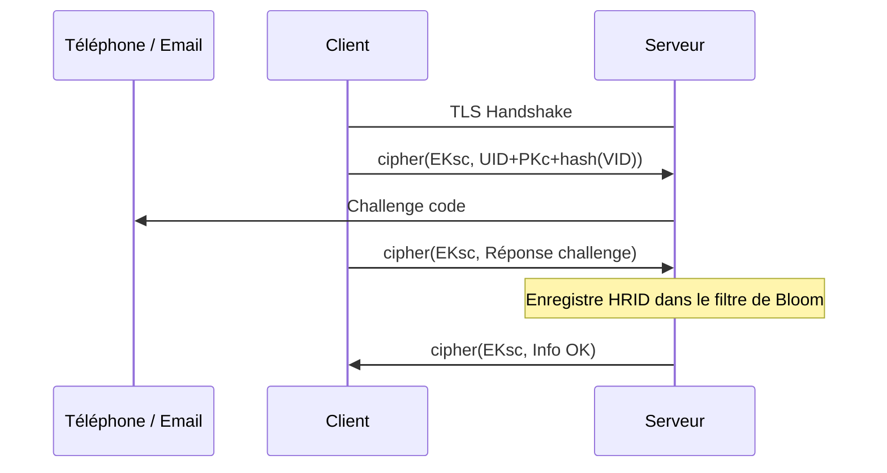
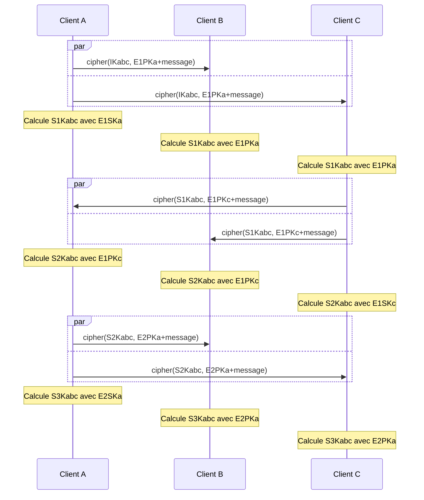

# Sécurité

Détails sur la sécurité et l'implémentation algorithmique de la cryptographie

[Page précédente : Spécifications](https://relex12.github.io/fr/Decentralized-Password-Manager/Specifications)

[Page suivante : Fonctionnalités](https://relex12.github.io/fr/Decentralized-Password-Manager/Fonctionnalites)

## Sommaire

[toc]

## Prérequis

* une fonction de hachage (SHA256, SHA384, SHA512) : $hash$
* une courbe elliptique (Curve25519)
* un échange de Diffie-Hellman sur courbe elliptique (X25519) : $ecdh(PK,SK)$
* un système de signature sur courbe elliptique (Ed25519) : $ecdsa(SK)$
* un couplage
* un échange de Diffe-Hellman à base de couplage : $pbdh(PKa,PKb,SK)$
* un système de chiffrement symétrique (AES_256_GCM) : $cipher(SK)$
* une fonction de dérivation de clé (PBKDF2) : $kdf(SK)$
* un format de certificat (X.509)

## Diagrammes de séquence

> TODO: faire des diagrammes, quitte à les inclure dans le readme 03 et supprimer celui-ci s'il est de trop
> peut-être pas en fait
### Séquence d'enregistrement

* clés publique et privée du serveur : $PKs$ et $SKs$
* clés publique et privée d'un client : $PKc$ et $SKc$
* identifiant utilisateur et identifiant du coffre : $UID$ et $VID$
* clé éphémère symétrique : $EKsc=ecdh(PKs,SKc)=ecdh(PKc,SKs)$

### Découverte des clients et chiffrement avec le serveur

* clés publique et privée du serveur : $PKs$ et $SKs$
* identifiant utilisateur et identifiant du coffre : $UID$ et $VID$
* clé publique et privée d'un client A, identifiant d'enregistrement et hachage :
    * $PKa$ et $SKa$
    * $RIDa=UID+PKa+VID$
    * $HRIDa=hash(hash(UID)+hash(PKa)+hash(VID))$
* clé publique et privée d'un client B, identifiant d'enregistrement et hachage :
    * $PKb$ et $SKb$
    * $RIDb=UID+PKb+VID$
    * $HRIDb=hash(hash(UID)+hash(PKb)+hash(VID))$
* clé publique et privée d'un client C, identifiant d'enregistrement et hachage :
    * $PKc$ et $SKc$
    * $RIDc=UID+PKc+VID$
    * $HRID=hash(hash(UID)+hash(PKc)+hash(VID))$
* clés éphémères publique et privée de A, B et C : $EPKa$ et $ESKa$, $EPKb$ et $ESKb$, $EPKc$ et $ESKc$
* clés éphémères symétriques entre A, B, C respectivement et S : $EKsa=ecdh(PKs,ESKa)$, $EKsb=ecdh(PKs,ESKb)$, $EKsb=ecdh(PKs,ESKb)$
* clé partagée symétrique initiale : $IKabc=pbdh(PKa,PKb,SKc)$
* message chiffré de bout en bout : $message=cipher(IKabc, RIDa+RIDb+RIDc)$
* numéro de sécurité : $SNabc=hash(HRIDa+HRIDb+HRIDc)$

### Envoi de messages entre clients

* identifiant utilisateur et identifiant du coffre : $UID$ et $VID$
* clé publique et privée d'un client A, identifiant d'enregistrement et hachage :
    * $PKa$ et $SKa$
    * $RIDa=UID+PKa+VID$
    * $HRIDa=hash(hash(UID)+hash(PKa)+hash(VID))$
* clé publique et privée d'un client B, identifiant d'enregistrement et hachage :
    * $PKb$ et $SKb$
    * $RIDb=UID+PKb+VID$
    * $HRIDb=hash(hash(UID)+hash(PKb)+hash(VID))$
* clé publique et privée d'un client C, identifiant d'enregistrement et hachage :
    * $PKc$ et $SKc$
    * $RIDc=UID+PKc+VID$
    * $HRID=hash(hash(UID)+hash(PKc)+hash(VID))$
* clés éphémères publique et privée de A, B et C : $E1PKa$ et $E1SKa$, $E1PKb$ et $E1SKb$, $E1PKc$ et $E1SKc$
* clé partagée symétrique initiale : $IKabc=pbdh(PKa,PKb,SKc)$​
* clés partagées éphémères potentielles :
    * $S1Kabc=pbdh(E1PKa,PKb,SKc)$
    * $S2Kabc=pbdh(E1PKa,PKb,E1SKc)$
    * $S3Kabc=pbdh(E2PKa,PKb,E1SKc)$

## Structures de données

## Format des trames

Le gestionnaire de mots de passe est composé de deux couches : l'échange de messages entre les clients et le serveur fournit une couche de service qui est utilisée par les messages entre clients pour être transportés et chiffrés de bout en bout.

La couche de service du gestionnaire de mot de passe repose sur la couche session du modèle OSI, toutes les trames qui suivent sont donc encapsulées dans des messages TLS et surviennent après le handshake TLS, c'est-à-dire la récupération du certificat du serveur et la création d'un secret partagées. Tous les messages entre les clients et le serveur sont chiffrés.

### Requêtes de la couche service (client vers serveur)

#### Demande d'enregistrement

* type de requête (8 bits)
* clé publique (256 bits)
* taille de l'identifiant utilisateur (8 bits)
* identifiant utilisateur (jusqu'à 255 octets)
* hachage de l'identifiant du coffre (256 bits)

#### Envoi de la réponse au challenge

* type de requête (8 bits)
* hachage de l'identifiant d'enregistrement (256 bits)
* réponse (8 octets)

#### Demande de récupération de message

* type de requête (8 bits)
* hachage de l'identifiant d'enregistrement (256 bits)

#### Demande d'ajout de message en file d'attente

* type de requête (8 bits)
* hachage de l'identifiant d'enregistrement (256 bits)
* nombre de destinataires (8 bits)
  * hachage de l'identifiant d'enregistrement du destinataire (256 bits)
* taille du message (16 bits)
* message (jusqu'à 65535 octets)

### Réponses de la couche service (serveur vers client)

#### Envoi de certificat

#### Confirmation d'enregistrement

* type de réponse (8 bits)

#### Acquittement d'ajout de message

* type de réponse (8 bits)

>  Rappel : pas de distinction entre réussite et échec dans l'acquittement d'ajout de message en file d'attente, sauf si l'erreur survenue est autre

#### Erreur lors de l'ajout de message

* type de réponse (8 bits)
* data

#### Demande de synchronisation manuelle

* type de réponse (8 bits)

#### Envoi des messages en liste d'attente

* type de réponse (8 bits)
* nombre de messages (8 bits)
  * hachage de l'identifiant d'enregistrement de l'émetteur du message (256 bits)
  * taille du message (16 bits)
  * message (jusqu'à 65535 octets)

### Messages de la couche application (entre clients)

> TODO: liste exhaustive des types de messages

#### Découverte des clients

* type de message (8 bits)
* hachage de l'identifiant utilisateur ? (256 bits)
* hachage de l'identifiant du coffre ? (256 bits)
* nombre de clients dans le coffre (8 bits)
    * clé publique du client (256 bits)
    * hachage de l'identifiant d'enregistrement du client ? (256 bits)
    * taille du nom de l'appareil (8 bits)
    * nom de l'appareil pour l'utilisateur (jusqu'à 255 octets)

#### Mise à jour du coffre

* type de message (8 bits)
* hachage de l'identifiant d'enregistrement de l'émetteur du message (256 bits)
* nouvelle clé publique de l'émetteur (256 bits)
* taille de la mise à jour (16 bits)
* mise à jour (jusqu'à 65535 octets)

> La taille d'une mise à jour en situation réelle doit encore être déterminée.

