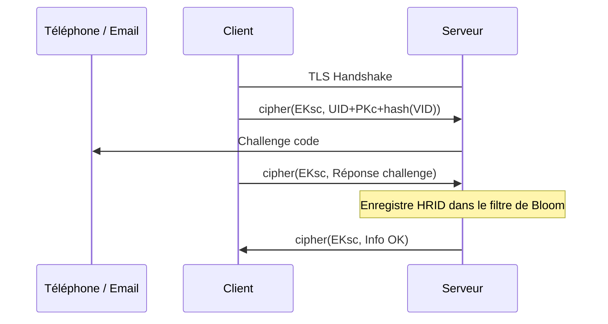
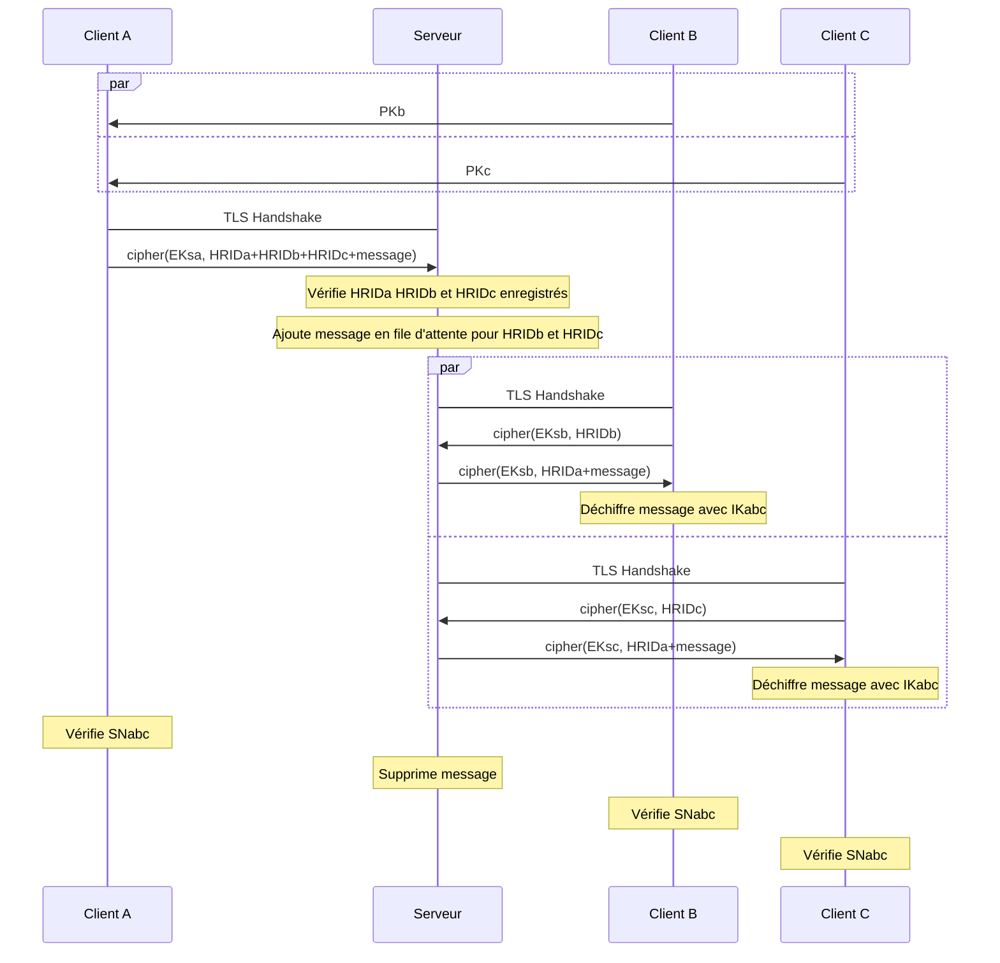
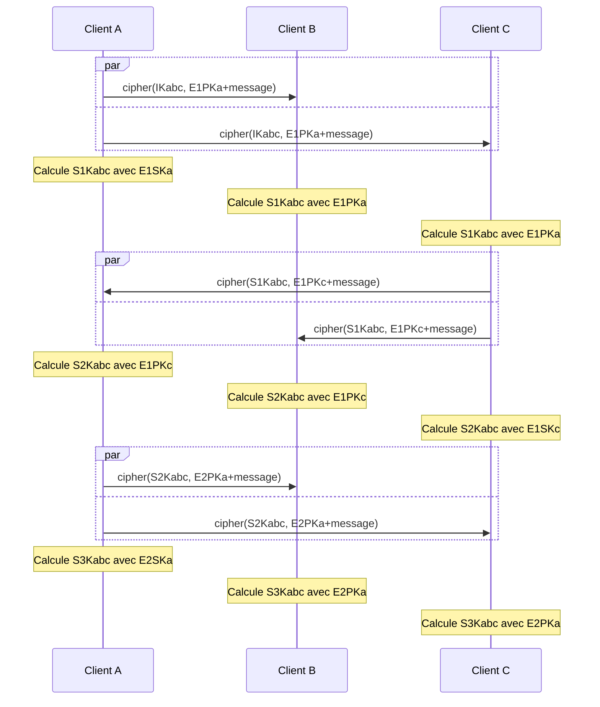

# Sécurité

Détails sur la sécurité et l'implémentation algorithmique de la cryptographie

[Page précédente : Spécifications](https://relex12.github.io/fr/Decentralized-Password-Manager/Specifications)

[Page suivante : Fonctionnalités](https://relex12.github.io/fr/Decentralized-Password-Manager/Fonctionnalites)

## Sommaire

[toc]

## Prérequis

* une fonction de hachage (SHA256, SHA384, SHA512) : $hash$
* une courbe elliptique (Curve25519)
* un échange de Diffie-Hellman sur courbe elliptique (X25519) : $ecdh(PK,SK)$
* un système de signature sur courbe elliptique (Ed25519) : $ecdsa(SK)$
* un couplage
* un échange de Diffe-Hellman à base de couplage : $pbdh(PKa,PKb,SK)$
* un système de chiffrement symétrique (AES_256_GCM) : $cipher(SK)$
* une fonction de dérivation de clé (PBKDF2) : $kdf(SK)$
* un format de certificat (X.509)

## Diagrammes de séquence

Les échanges entre les clients et le serveur du gestionnaire de mots de passe sont spécifiés pour répondre à des problématiques de sécurité précises. Voici une présentation plus détaillée des informations contenues dans les échanges récurrents dans l'utilisation du gestionnaire avec considérations cryptographiques.

### Séquence d'enregistrement

* clés publique et privée du serveur : $PKs$ et $SKs$
* clés publique et privée d'un client : $PKc$ et $SKc$
* identifiant utilisateur et identifiant du coffre : $UID$ et $VID$
* clé éphémère symétrique : $EKsc=ecdh(PKs,SKc)=ecdh(PKc,SKs)$

### Découverte des clients et chiffrement avec le serveur

* clés publique et privée du serveur : $PKs$ et $SKs$
* identifiant utilisateur et identifiant du coffre : $UID$ et $VID$
* clé publique et privée d'un client A, identifiant d'enregistrement et hachage :
    * $PKa$ et $SKa$
    * $RIDa=UID+PKa+VID$
    * $HRIDa=hash(hash(UID)+hash(PKa)+hash(VID))$
* clé publique et privée d'un client B, identifiant d'enregistrement et hachage :
    * $PKb$ et $SKb$
    * $RIDb=UID+PKb+VID$
    * $HRIDb=hash(hash(UID)+hash(PKb)+hash(VID))$
* clé publique et privée d'un client C, identifiant d'enregistrement et hachage :
    * $PKc$ et $SKc$
    * $RIDc=UID+PKc+VID$
    * $HRID=hash(hash(UID)+hash(PKc)+hash(VID))$
* clés éphémères publique et privée de A, B et C : $EPKa$ et $ESKa$, $EPKb$ et $ESKb$, $EPKc$ et $ESKc$
* clés éphémères symétriques entre A, B, C respectivement et S : $EKsa=ecdh(PKs,ESKa)$, $EKsb=ecdh(PKs,ESKb)$, $EKsb=ecdh(PKs,ESKb)$
* clé partagée symétrique initiale : $IKabc=pbdh(PKa,PKb,SKc)$
* message chiffré de bout en bout : $message=cipher(IKabc,hash(UID)+hash(VID)+PKa+PKb+PKc)$
* numéro de sécurité : $SNabc=hash(HRIDa+HRIDb+HRIDc)$

### Envoi de messages entre clients

* identifiant utilisateur et identifiant du coffre : $UID$ et $VID$
* clé publique et privée d'un client A, identifiant d'enregistrement et hachage :
    * $PKa$ et $SKa$
    * $RIDa=UID+PKa+VID$
    * $HRIDa=hash(hash(UID)+hash(PKa)+hash(VID))$
* clé publique et privée d'un client B, identifiant d'enregistrement et hachage :
    * $PKb$ et $SKb$
    * $RIDb=UID+PKb+VID$
    * $HRIDb=hash(hash(UID)+hash(PKb)+hash(VID))$
* clé publique et privée d'un client C, identifiant d'enregistrement et hachage :
    * $PKc$ et $SKc$
    * $RIDc=UID+PKc+VID$
    * $HRID=hash(hash(UID)+hash(PKc)+hash(VID))$
* clés éphémères publique et privée de A, B et C : $E1PKa$ et $E1SKa$, $E1PKb$ et $E1SKb$, $E1PKc$ et $E1SKc$
* clé partagée symétrique initiale : $IKabc=pbdh(PKa,PKb,SKc)$​
* clés partagées éphémères potentielles :
    * $S1Kabc=pbdh(E1PKa,PKb,SKc)$
    * $S2Kabc=pbdh(E1PKa,PKb,E1SKc)$
    * $S3Kabc=pbdh(E2PKa,PKb,E1SKc)$

## Structures de données

## Format des trames

Le gestionnaire de mots de passe est composé de deux couches : l'échange de messages entre les clients et le serveur fournit une couche de service qui est utilisée par les messages entre clients pour être transportés et chiffrés de bout en bout.

La couche de service du gestionnaire de mot de passe repose sur la couche session du modèle OSI, toutes les trames qui suivent sont donc encapsulées dans des messages TLS et surviennent après le *handshake TLS*, c'est-à-dire la récupération du certificat du serveur et la création d'un secret partagées. Tous les messages entre les clients et le serveur sont chiffrés.

### Requêtes de la couche service (client vers serveur)

* Demande d'enregistrement
    * type de requête (8 bits)
    * clé publique (256 bits)
    * hachage de l'identifiant du coffre (256 bits)
    * taille de l'identifiant utilisateur (8 bits)
    * identifiant utilisateur (jusqu'à 255 octets)

* Envoi de la réponse au challenge
    * type de requête (8 bits)
    * hachage de l'identifiant d'enregistrement (256 bits)
    * réponse (8 octets)

* Demande de récupération de message
    * type de requête (8 bits)
    * hachage de l'identifiant d'enregistrement (256 bits)

* Demande d'ajout de message en file d'attente
    * type de requête (8 bits)
    * hachage de l'identifiant d'enregistrement (256 bits)
    * nombre de destinataires (8 bits)
    * hachage de l'identifiant d'enregistrement du destinataire (256 bits)
    * taille du message (16 bits)
    * message (jusqu'à 65535 octets)

### Réponses de la couche service (serveur vers client)

* Info ou Erreur
    * type de réponse (8 bits)
    * code (8 bits)

    > Lorsque le serveur transmet une information ou une erreur au client, il utilise le même type de trame et transmet le code de l'information ou de l'erreur. Les cas de figure sont par exemple :
    > * info : confirmation d'enregistrement
    > * info : acquittement d'ajout de message (rappel : il n'y a pas de distinction entre réussite et échec dans l'acquittement d'ajout de message en file d'attente, sauf si l'erreur survenue est autre)
    > * info : synchronisation manuelle du client recommandée ou requise
    > * erreur : liste de messages en attente non vide lors de l'ajout d'un message
    > * erreur : service indisponible (lors d'une attaque par exemple)
    > * erreur : limite du nombre de messages en attente pour ce coffre atteinte

* Envoi des messages en liste d'attente
    * type de réponse (8 bits)
    * nombre de messages (8 bits)
    * hachage de l'identifiant d'enregistrement de l'émetteur du message (256 bits)
    * taille du message (16 bits)
    * message (jusqu'à 65535 octets)

### Messages de la couche application (entre clients)

> Ces messages sont indépendants de la couche service décrite ci-dessus, si bien que les trames échangées entre clients sont identiques qu'elles soient transmises via le serveur ou via un autre moyen comme le Bluetooth, QR Code ou le protocole ICE.

* Découverte des clients
    * type de message (8 bits)
    * clé publique (256 bits)

    > Ce message initial ne contient aucune information sur le coffre car il n'est pas chiffré de bout en bout, le serveur pourrait l'intercepter et récupérer ses données.

    * type de message (8 bits)
    * clé publique de l'émetteur (256 bits)
    * hachage de l'identifiant utilisateur (256 bits)
    * hachage de l'identifiant du coffre (256 bits)
    * nombre de clients dans le coffre (8 bits)
        * clé publique du client (256 bits)
        * taille du nom de l'appareil (8 bits)
        * nom de l'appareil pour l'utilisateur (jusqu'à 255 octets)

    > Dans ce message, la clé publique de l'émetteur et le type de message ne sont pas chiffrés de bout en bout. Le reste est chiffré de bout en bout de manière pair-à-pair, ce message doit être stocké plusieurs fois sur le serveur et possède donc une date de péremption plus courte.

    > Comme l'échange n'est pas chiffré lors du premier message et afin de limiter les données exploitables par le serveur, l'utilisateur devra noter le nom de ses appareils depuis l'appareil maître.

* Mise à jour du coffre
    * type de message (8 bits)
    * hachage de l'identifiant d'enregistrement de l'émetteur du message (256 bits)
    * nouvelle clé publique de l'émetteur (256 bits)
    * taille de la mise à jour (16 bits)
    * mise à jour (jusqu'à 65468 octets)

    > La taille maximale du message est de 65535 octets tous champs inclus car du point de vue de la couche service, la taille du message est décrite dans un champs de 16 bits.

### Champs des trames

Dans chaque trame, le type composé de 8 bits sert à déterminer le sens d'un message et d'en déduire la syntaxe pour le lire. Le premier bit sert à différencier les messages à destination du protocole ICE et ceux du gestionnaire de mot de passe. Le deuxième bit permet de distinguer les messages de la couche service et les messages de la couche chiffrée de bout en bout. Le troisième bit différencie les requêtes et les réponses au sein de chaque couche. Les cinq autres bits servent à préciser le type de trames parmi les messages possibles au regard des trois premiers bits, ce qui représente 32 types de messages possibles par protocole, par couche et par sens requête / réponse.

Dans les trames de types Info ou Erreur, le code est composé de 8 bits : le premier bit permet de différencier les informations et les erreurs. Pour les erreurs, le deuxième bit différencie les erreurs qui sont la faute du client et les erreurs qui sont la faute du serveur, de la même manière que le protocole HTTP, et le troisième bit permet d'indiquer si l'erreur est inattendue ou pas, afin de distinguer les problèmes survenus lors du traitement du message (dus à une mauvaise implémentation) et les erreurs justifiées, en cas de d'erreur du client ou d'indisponibilité du service à cause de facteur extérieur, comme une attaque ou une panne par exemple. Le cinq autres bits servent à préciser le type d'information ou d'erreur, soit 32 codes possibles.

Dans toutes les trames, lorsqu'un champ est de taille variable, il est précédé d'un champ précisant sa longueur. Si l'utilisation d'une couche inférieure TLS, TCP ou UDP permet de prédire la taille des données de la trame, ces champs longueurs ne seront pas utiles, sauf s'il y en a plusieurs dans une seule trame.

### Support du protocole ICE

En plus des trames décrites au-dessus, le serveur et les clients accepteront les messages du protocole ICE. Le serveur fera également office de serveur STUN et TURN, afin respectivement de communiquer aux clients leur adresse publique et d'échanger leurs données entre eux. Les implémentations du serveur et des clients devront répondre aux RFC [8445](https://datatracker.ietf.org/doc/html/rfc8445), [8489](https://datatracker.ietf.org/doc/html/rfc8489) et [8656](https://datatracker.ietf.org/doc/html/rfc8656). Les messages seront précédés du champ type comme décrit plus tôt.

