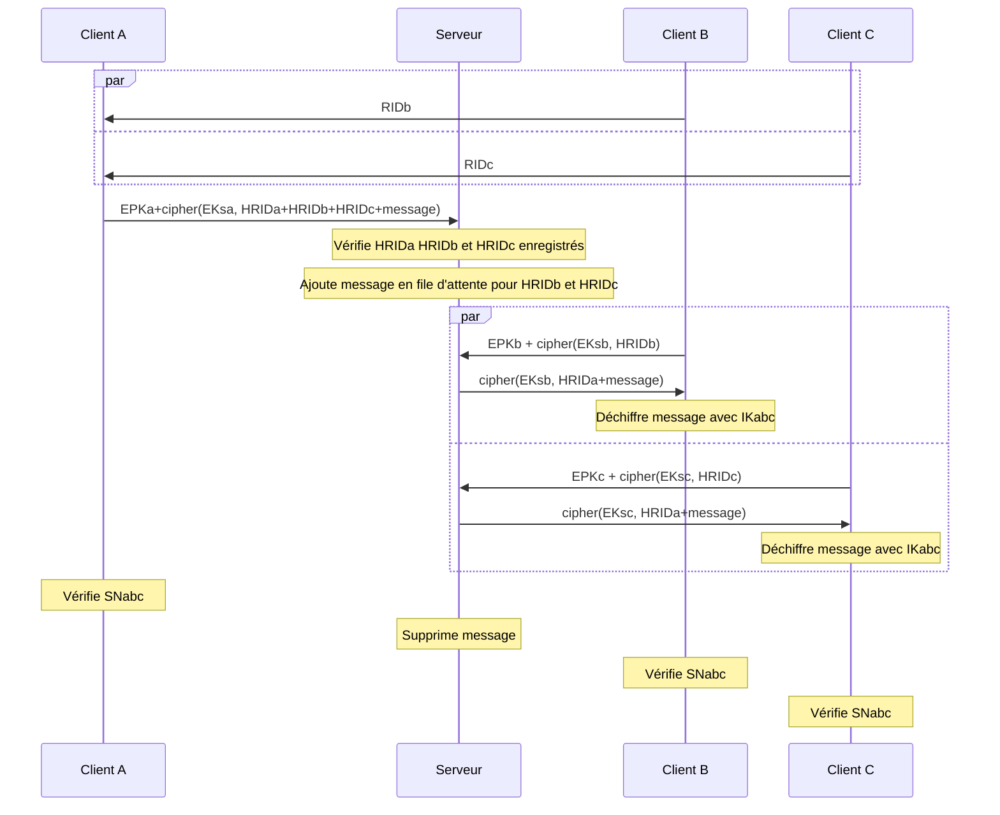

# Sécurité

Détails sur la sécurité et l'implémentation algorithmique de la cryptographie

[Page précédente : Spécifications](https://relex12.github.io/fr/Decentralized-Password-Manager/Specifications)

[Page suivante : Fonctionnalités](https://relex12.github.io/fr/Decentralized-Password-Manager/Fonctionnalites)

## Sommaire

[toc]

## Prérequis

* une fonction de hachage (SHA256, SHA384, SHA512) : $hash$
* une courbe elliptique (Curve25519)
* un échange de Diffie-Hellman sur courbe elliptique (X25519) : $ecdh(PK,SK)$
* un système de signature sur courbe elliptique (Ed25519) : $ecdsa(SK)$
* un couplage
* un échange de Diffe-Hellman à base de couplage : $pbdh(PKa,PKb,SK)$
* un système de chiffrement symétrique (AES_256_GCM) : $cipher(SK)$
* une fonction de dérivation de clé (PBKDF2) : $kdf(SK)$
* un format de certificat (X.509)

## Séquence d'enregistrement

> TODO: faire des diagrammes, quitte à les inclure dans le readme 03 et supprimer celui-ci s'il est de trop
> peut-être pas en fait

* clés publique et privée de l'autorité de certificats : $PKca$ et $SKca$
* certificat de l'autorité de certificats : $Cert\_ca = PKca+validity$​
* clés publique et privée du serveur : $PKs$ et $SKs$
* certificat du serveur : $Cert\_s = PKca+validity+CA\ name + ecdsa(SKca,PKca+validity+CA\ name)$
* clés publique et privée d'un client : $PKc$ et $SKc$
* identifiant d'enregistrement : $RID=user\_id+PKc+vault\_id$
* hachage d'identifiant d'enregistrement : $HRID=hash(hash(user\_id)+hash(PKc)+hash(vault\_id))$
* clé éphémère symétrique : $EKsc=ecdh(PKs,SKc)=ecdh(PKc,SKs)$

## Découverte des clients et chiffrement avec le serveur

* clés publique et privée du serveur : $PKs$ et $SKs$
* clé publique et privée d'un client A, identifiant d'enregistrement et hachage :
    * $PKa$ et $SKa$
    * $RIDa=user\_id+PKa+vault\_id$
    * $HRIDa=hash(hash(user\_id)+hash(PKa)+hash(vault\_id))$
* clé publique et privée d'un client B, identifiant d'enregistrement et hachage :
    * $PKb$ et $SKb$
    * $RIDb=user\_id+PKb+vault\_id$
    * $HRIDb=hash(hash(user\_id)+hash(PKb)+hash(vault\_id))$
* clé publique et privée d'un client C, identifiant d'enregistrement et hachage :
    * $PKc$ et $SKc$
    * $RIDc=user\_id+PKc+vault\_id$
    * $HRID=hash(hash(user\_id)+hash(PKc)+hash(vault\_id))$
* clés éphémères publique et privée de A, B et C : $EPKa$ et $ESKa$, $EPKb$ et $ESKb$, $EPKc$ et $ESKc$
* clés éphémères symétriques entre A, B, C respectivement et S : $EKsa=ecdh(PKs,ESKa)$, $EKsb=ecdh(PKs,ESKb)$, $EKsb=ecdh(PKs,ESKb)$
* clé partagée symétrique initiale : $IKabc=pbdh(PKa,PKb,SKc)$
* message chiffré de bout en bout : $message=cipher(IKabc, RIDa+RIDb+RIDc)$
* numéro de sécurité : $SNabc=hash(HRIDa+HRIDb+HRIDc)$

## Envoi de messages entre clients

* clé publique et privée d'un client A, identifiant d'enregistrement et hachage :
    * $PKa$ et $SKa$
    * $RIDa=user\_id+PKa+vault\_id$
    * $HRIDa=hash(hash(user\_id)+hash(PKa)+hash(vault\_id))$
* clé publique et privée d'un client B, identifiant d'enregistrement et hachage :
    * $PKb$ et $SKb$
    * $RIDb=user\_id+PKb+vault\_id$
    * $HRIDb=hash(hash(user\_id)+hash(PKb)+hash(vault\_id))$
* clé publique et privée d'un client C, identifiant d'enregistrement et hachage :
    * $PKc$ et $SKc$
    * $RIDc=user\_id+PKc+vault\_id$
    * $HRID=hash(hash(user\_id)+hash(PKc)+hash(vault\_id))$
* clés éphémères publique et privée de A, B et C : $E1PKa$ et $E1SKa$, $E1PKb$ et $E1SKb$, $E1PKc$ et $E1SKc$
* clé partagée symétrique initiale : $IKabc=pbdh(PKa,PKb,SKc)$​
* clés partagées éphémères potentielles :
    * $S1Kabc=pbdh(E1PKa,PKb,SKc)$
    * $S2Kabc=pbdh(E1PKa,PKb,E1SKc)$
    * $S3Kabc=pbdh(E2PKa,PKb,E1SKc)$

## Format des trames entre clients

> TODO: liste exhaustive des types de messages

### Découverte des clients

* type de message (4 bits)
* clé publique (256 bits)
* bloc chiffré
  * nombre de clients dans le coffre (8 bits)
    * taille du nom de l'appareil (8 bits)
    * nom de l'appareil pour l'utilisateur (jusqu'à 255 octets)
    * clé publique du client (256 bits)
    * hachage de l'identifiant d'enregistrement du client(256 bits)

### Mise à jour du coffre

* type de message (4 bits)
* bloc chiffré
  * hachage de l'identifiant d'enregistrement de l'émetteur du message (256 bits)
  * nouvelle clé publique de l'émetteur (256 bits)
  * taille de la mise à jour (16 bits)
  * mise à jour (jusqu'à 65535 octets)

> La taille d'une mise à jour en situation réelle doit encore être déterminée.

## Format des requêtes entre client et serveur

> TODO: liste exhaustive des types de requêtes
>
> TODO: ajouter le protocole ICE

### Demande de certificat

* type de requête (8 bits)

### Demande d'enregistrement

* type de requête (8 bits)
* clé publique (256 bits)
* bloc chiffré
  * taille de l'identifiant utilisateur (8 bits)
  * identifiant utilisateur (jusqu'à 255 octets)
  * hachage de l'identifiant d'enregistrement (256 bits)

> TODO: est-ce que le serveur doit connaître l'identifiant du coffre ?

### Envoi de la réponse au challenge

* type de requête (8 bits)
* clé publique éphémère (256 bits)
* bloc chiffré
  * hachage de l'identifiant d'enregistrement (256 bits)
  * réponse (8 octets)

### Demande de récupération de message

* type de requête (8 bits)
* clé publique éphémère (256 bits)
* bloc chiffré
  * hachage de l'identifiant d'enregistrement (256 bits)

